# 会话页列表优先与会话内切换代理（#2bsed）

## 状态

- Status: 已实现（候选节点双栏选择扩展）
- Created: 2026-04-24
- Last: 2026-04-28

## 背景 / 问题陈述

- `/sessions` 当前把创建入口与在线列表并排堆在首页，主次倒置，列表扫描效率低。
- 会话列表仍使用“活动监听 / 在线监听牌组”一类命名，不符合真实的会话运营语义。
- 当前会话创建后无法直接切换绑定节点，操作员只能关闭后重建，导致端口与监听地址不稳定。
- 节点选择缺少“当前会话最近使用 / 当前 profile 最近使用”的排序依据，重复运营成本高。
- 会话代理选择需要从“单节点”升级为“一个 IP + 一组候选节点”，由后端在候选集中选择延迟最低且可用的实际节点，避免同一出口 IP 下节点故障时必须人工重建会话。

## 目标 / 非目标

### Goals

- 把 `/sessions` 重构成“会话列表优先”的页面，首页只保留列表与一个 `创建会话` 入口按钮。
- 创建弹窗改为宽屏双栏 IP -> 节点候选选择界面，支持多选 IP 批量创建。
- 为每条会话增加切换代理入口，并允许在不改变 `session_id / listen / port` 的前提下切换 `selected_ip + candidate_node_ids`。
- 新增节点 usage 持久化与查询接口，支持“当前会话最近使用 / 当前 profile 最近使用”两种排序。
- 会话持久化新增 `candidate_node_ids`，历史会话默认回填当前 `node_id`，避免升级后行为漂移。
- 为改动补齐 Storybook、交互覆盖与视觉证据，并推进到 PR merge-ready。

### Non-goals

- 不重做 `/proxies` 的 grouped node 运营页。
- 不做持续后台健康巡检；候选节点自动择优限定在创建、切换、启动/重建和当前节点不可用时的会话路径。
- 不改变关闭会话语义，不自动 merge / cleanup。

## 需求（Requirements）

### MUST

- `/sessions` 首屏默认只展示页面标题、状态信息、会话列表与一个 `创建会话` 按钮。
- `创建会话` 弹窗必须完全替换旧 any/geo/ip 表单，使用双栏 IP -> 候选节点选择器；选择多个 IP 时每个 IP 创建一个会话。
- 会话列表代理列必须提供 edit icon，并弹出同一双栏选择器；切换提交 `selected_ip + candidate_node_ids`。
- 左栏必须支持搜索，并可按订阅或城市分组展示 IP；IP 行展示 IP、另一维摘要、相对最近使用时间、绝对时间 tooltip 与最低延迟。
- 右栏必须展示当前 IP 下节点，默认全选，支持多选；节点行展示名称、订阅/地理摘要、延迟状态和测速历史 tooltip。
- 会话列表必须展示当前 selected IP 的国家/地区/城市摘要，并移除重复的 port badge。
- 会话列表上方必须提供一个按 shadcn/ui `ToggleGroup` 实现、带本地记忆的复制格式选择器，固定支持 `SOCKS URI`、`HTTP URI` 与 `主机:端口` 三种输出。
- 复制格式 `label` 只允许出现在选项左侧；不得再在选择器上方、下方或独立卡片内重复展示。
- 复制格式区域不得再渲染独立的预览 / 占位提示卡片；切换格式只影响后续复制结果，不额外占用列表上方高度。
- 会话列表必须把 owner-facing 地址与 runtime bind 地址分离：原始 bind host 只保留给运行时/诊断，默认表格展示与复制都使用可访问的 `display_address`。
- 当 bind host 为 `0.0.0.0` / `::` / `[::]` 时，owner-facing UI 不得直接展示通配地址；应优先使用 `session_public_host`，否则回退到当前页面 hostname。
- 当 bind host 为明确地址（例如域名、`192.168.*` 或 `127.0.0.1`）时，`display_address` 必须直接复用该 host，不得再被 UI 强制替换。
- 会话地址列必须在文本右侧提供复制 icon，按当前选择器格式复制完整代理地址。
- 会话列表必须支持行多选、表头全选可见会话、鼠标/触摸从选择列按下后拖拽批量勾选/取消，以及 Shift 连续选择。
- 会话列表必须提供所选数量、批量关闭与批量撤销入口；批量关闭逐条复用现有 10 秒撤销窗口，不新增后端批量关闭 API。
- 会话关闭入口必须先进入 10 秒撤销窗口：点击后整行置灰、非撤销操作禁用、关闭按钮切换为撤销按钮，倒计时结束后才真正移除会话。
- `PATCH /api/v1/profiles/{profile_id}/sessions/{session_id}/node` 必须保持 `session_id / listen / port / created_at` 不变，只更新 `selected_ip / candidate_node_ids` 与当前活跃 `node_id / proxy_name`。
- 创建、切换和重建会话时，后端必须校验候选节点属于当前 profile effective pool 且包含 `selected_ip`，并选择候选中已知可用且中位延迟最低的节点；候选全失败时返回明确错误。
- 创建会话与切换代理都必须更新 profile-scope 与 session-scope 的 node usage。
- `SessionRecord`、列表响应和打开响应必须包含 `candidate_node_ids`；旧会话候选集默认回填为当前 `node_id`。
- SQLite `sessions` 必须作为启动恢复的真相源；程序重启或更新后，未显式关闭的会话仍需继续出现在 `/sessions` 列表。
- 启动 reconcile 只有在某条会话的 `node_id + selected_ip` 已被明确判定失效时才允许清理；不得因为运行时恢复失败、端口占用或有效节点暂不可判定而清空列表。

### SHOULD

- IP/节点筛选支持节点名、导入/来源名、IP、国家/地区/城市。
- IP/节点选择列表只展示当前 profile effective pool 内的可用节点。
- 新旧 usage 时间为空时统一排后，并以节点名升序作为稳定兜底。

## 验收标准（Acceptance Criteria）

- Given `/sessions` 首页
  When 页面首次加载
  Then 主体只展示会话列表与 `创建会话` 按钮，不再内联单个/批量创建表单。
- Given `创建会话` 弹窗
  When 选择一个 IP 并提交
  Then 创建一个会话，会话绑定该 `selected_ip` 和当前候选节点集，后端选择最低延迟可用节点作为活跃 `node_id`。
- Given `创建会话` 弹窗
  When 选择多个 IP 并提交
  Then 每个 IP 创建一个会话，每条会话持久化对应 IP 的候选节点集。
- Given 一个已有会话
  When 操作员切换 IP 或候选节点集
  Then `session_id / listen / port / created_at` 保持不变，只更新 `selected_ip / candidate_node_ids` 与活跃节点。
- Given 会话列表中的 selected IP 列
  When 节点 metadata 已存在
  Then 列表显示国家 / 地区 / 城市摘要，且不再重复展示 port badge。
- Given 会话列表上方的复制格式选择器
  When 操作员切换到另一种地址格式
  Then 选择结果被保存在浏览器本地，`label` 固定留在选项左侧，且页面上不再出现额外的预览 / 占位提示卡片。
- Given 会话 bind host 为 wildcard
  When 页面通过某个可访问 hostname 打开当前管理台
  Then 列表主文案与复制结果使用 `session_public_host` 或当前页面 hostname，而不是 `0.0.0.0:*`。
- Given 会话 bind host 为明确地址
  When 列表或创建响应需要展示 owner-facing 地址
  Then `display_address` 直接复用该 host，不做 loopback 强制替换。
- Given 会话列表中的代理地址列
  When 操作员点击复制 icon
  Then 系统按当前选择器生成并复制完整代理地址，例如 `socks://ops.example.com:10080`、`http://192.168.31.15:10080` 或 `192.168.31.15:10080`。
- Given 会话列表选择列
  When 操作员点击表头 checkbox、Shift 选择范围，或用鼠标/触摸按住选择列拖过多行
  Then 仅选择状态变化，不触发复制、编辑或关闭动作，并能对所选会话执行批量关闭/撤销。
- Given 会话列表中的关闭按钮
  When 操作员点击关闭
  Then 当前行先进入 10 秒撤销窗口并置灰，按钮切换为撤销；若未撤销，会话在 10 秒后消失。
- Given 双栏选择弹窗
  When 在订阅/城市分组间切换、输入关键词或取消部分候选节点
  Then 左栏 IP 和右栏节点状态保持同步，提交 payload 包含 `selected_ip + candidate_node_ids`。
- Given 已持久化的会话
  When 程序重启、升级或启动恢复阶段遇到临时运行时故障
  Then `/sessions` 列表仍显示这些会话，除非其 `node_id + selected_ip` 已被明确判定为失效组合。

## 质量门槛（Quality Gates）

- `cargo test --lib`
- `cargo clippy --all-targets --all-features -- -D warnings`
- `cd web && bun run check`
- `cd web && bun run typecheck`
- `cd web && bun run test`
- `cd web && bun run verify:stories`
- `cd web && bun run build`
- `cd web && bun run build-storybook`
- `cd web && bun run test-storybook`
- `cd web && bun run test:e2e`

## Visual Evidence

- source_type: `storybook_canvas`
  target_program: `mock-only`
  capture_scope: `browser-viewport`
  requested_viewport: `1440x920`
  viewport_strategy: `devtools-emulate`
  sensitive_exclusion: `N/A`
  submission_gate: `approved`
  story_id_or_title: `Features/Sessions/SessionCreateDialog/Default`
  state: `create dialog IP-node picker`
  evidence_note: 创建会话弹窗完全替换旧 any/geo/ip 表单；桌面宽屏展示左侧 IP 树状表格与右侧候选节点多选，默认全选当前 IP 的候选节点；测速 pill 按 100 / 200 / 1000 / 1000+ ms 阈值使用颜色表达质量等级。
  image:
  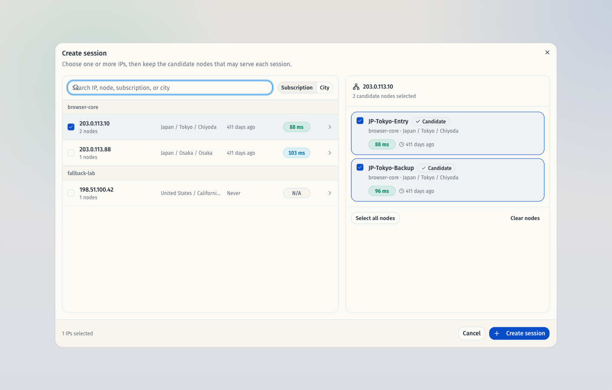

- source_type: `storybook_canvas`
  target_program: `mock-only`
  capture_scope: `browser-viewport`
  requested_viewport: `1440x920`
  viewport_strategy: `devtools-emulate`
  sensitive_exclusion: `N/A`
  submission_gate: `approved`
  story_id_or_title: `Features/Sessions/SessionNodeSelectDialog/Default`
  state: `switch dialog IP-node picker`
  evidence_note: 切换会话代理弹窗复用同一双栏选择器，保留会话监听地址与端口上下文，提交时发送 selected IP 与候选节点集合；IP 与节点测速数据均按质量等级着色。
  image:
  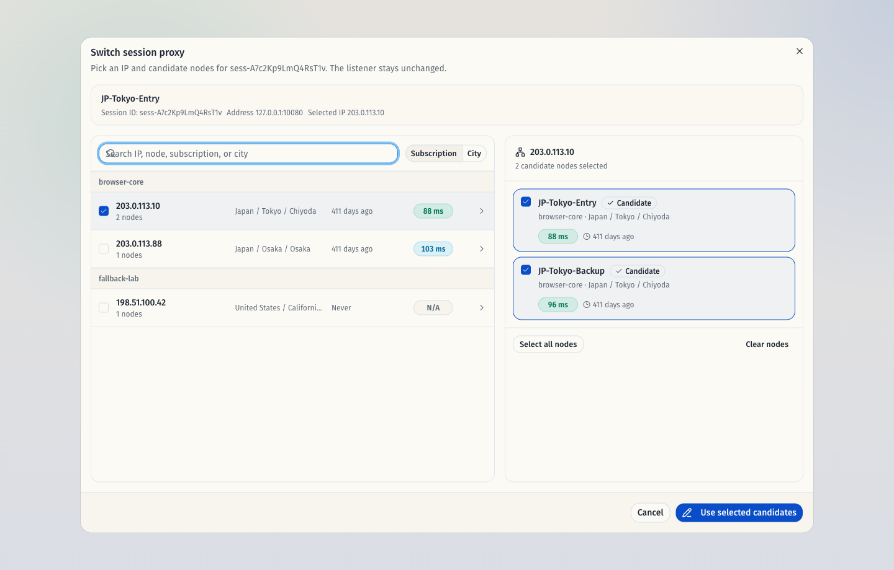

- source_type: `storybook_canvas`
  target_program: `mock-only`
  capture_scope: `browser-viewport`
  requested_viewport: `390x840`
  viewport_strategy: `devtools-emulate`
  sensitive_exclusion: `N/A`
  submission_gate: `approved`
  story_id_or_title: `Features/Sessions/SessionIpNodePicker/CompactViewport`
  state: `compact stacked picker`
  evidence_note: 窄屏下共享选择器自动堆叠为 IP 列表在上、候选节点在下，节点多选、彩色延迟等级与最近使用信息保持可读且不互相遮挡。
  image:
  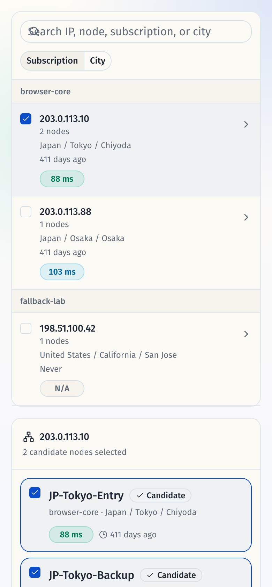

- source_type: `storybook_canvas`
  target_program: `mock-only`
  capture_scope: `browser-viewport`
  requested_viewport: `1440x920`
  viewport_strategy: `devtools-emulate`
  sensitive_exclusion: `N/A`
  submission_gate: `approved`
  story_id_or_title: `Features/Sessions/SessionIpNodePicker/LatencyGrades`
  state: `latency quality thresholds`
  evidence_note: `LatencyGrades` story 固定展示 88 ms、180 ms、650 ms、1,250 ms、failed 与未知延迟状态，验证测速颜色等级对应 100 / 200 / 1000 / 1000+ ms 阈值。
  image:
  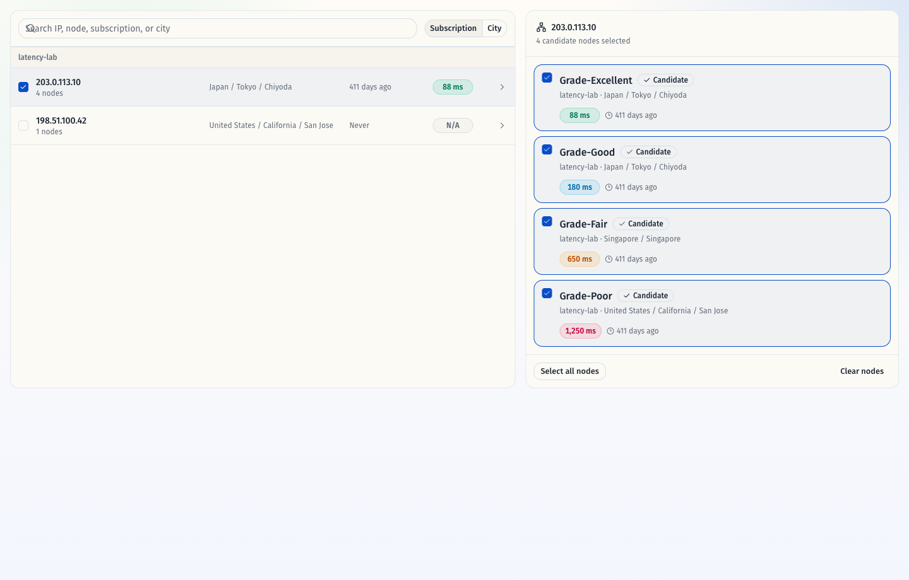

- source_type: `storybook_canvas`
  target_program: `mock-only`
  capture_scope: `browser-viewport`
  requested_viewport: `1440x980`
  viewport_strategy: `browser-resize-fallback`
  sensitive_exclusion: `N/A`
  submission_gate: `approved`
  story_id_or_title: `Pages/SessionsPage/Default`
  state: `batch selected close pending`
  evidence_note: 会话列表支持选择列多选；批量工具条展示已选 2 个会话，批量关闭后两行进入 10 秒撤销窗口，行内复制、编辑与关闭操作不会被选择拖拽误触发。
  image:
  PR: include
  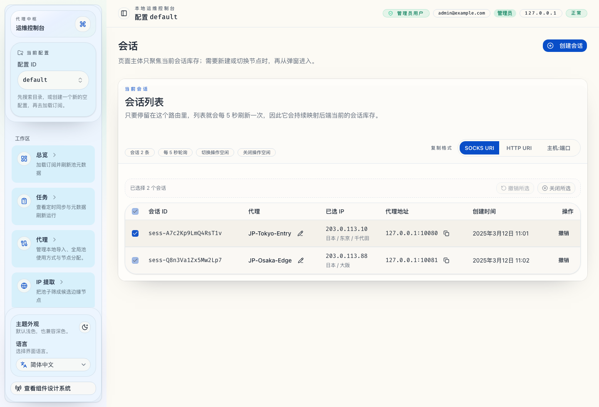

- PR: include
- source_type: `storybook_canvas`
  story_id_or_title: `Pages/SessionsPage/Default`
  state: `default`
  evidence_note: 会话页首屏只保留会话列表与一个创建入口；selected IP 列展示地理摘要，原 port badge 已移除，复制格式控件收敛到列表头部右上角并保持左侧 `复制格式` label + shadcn/ui ToggleGroup，独立预览卡片已删除，代理地址列继续展示 `display_address` 并提供复制按钮。
  image:
  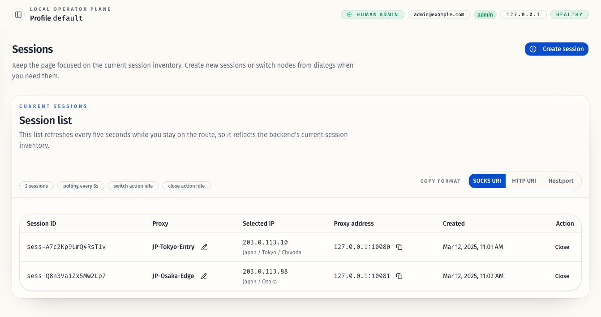

- PR: include
- source_type: `storybook_canvas`
  story_id_or_title: `Pages/SessionsPage/CopyFormatFlow`
  state: `http uri selected`
  evidence_note: 复制格式切换改为位于列表右上角的 shadcn/ui ToggleGroup 单选组，`复制格式` label 固定在选项左侧；切换到 `HTTP URI` 时无选中态错位，也不会再渲染额外的预览提示卡片。
  image:
  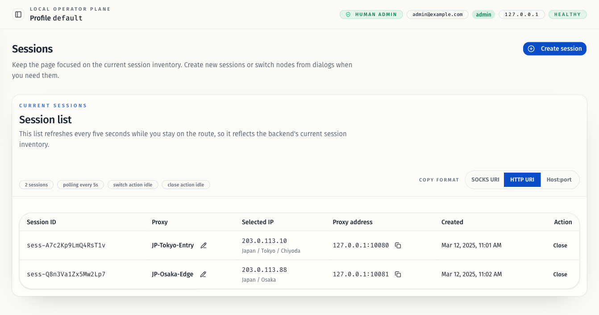

- source_type: `storybook_canvas`
  story_id_or_title: `Pages/SessionsPage/CreateDialogFlow`
  state: `create dialog open`
  evidence_note: 创建会话入口收敛为弹窗，单个创建与批量创建统一进同一对话框。
  image:
  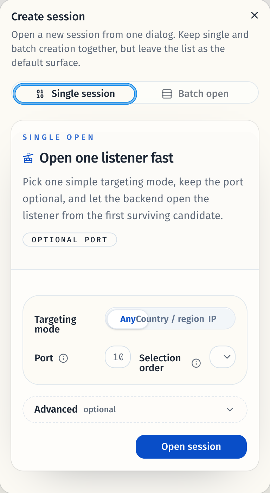

- source_type: `storybook_canvas`
  story_id_or_title: `Pages/SessionsPage/SwitchDialogFlow`
  state: `switch dialog open`
  evidence_note: 会话内切换代理弹窗支持筛选输入与“当前会话最近使用”排序入口。
  image:
  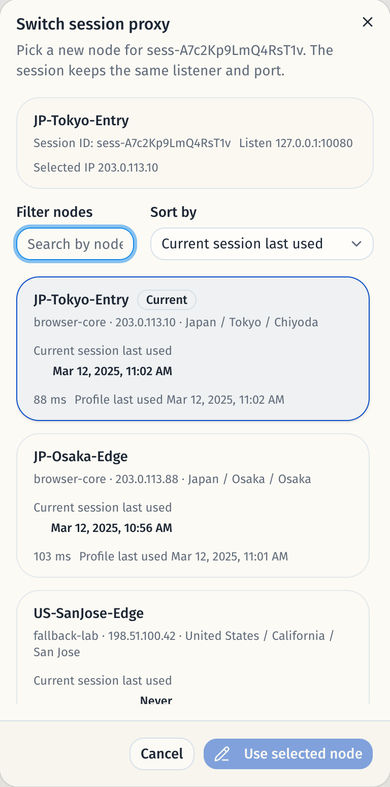

- source_type: `storybook_canvas`
  story_id_or_title: `Pages/SessionsPage/ClosingState`
  state: `close pending`
  evidence_note: 关闭动作先进入 10 秒撤销窗口；当前行整体置灰，关闭按钮切换为撤销，复制/编辑入口同步禁用。
  image:
  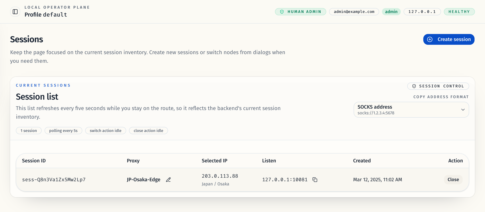

- source_type: `storybook_canvas`
  story_id_or_title: `features/sessions/SessionCreateDialog/CompactViewport`
  state: `compact dialog viewport`
  evidence_note: 创建会话弹窗在窄容器里会优先换行并收缩文案，不再出现定位方式切换条和端口 / 提取顺序控件互相挤压、重叠的问题。
  image:
  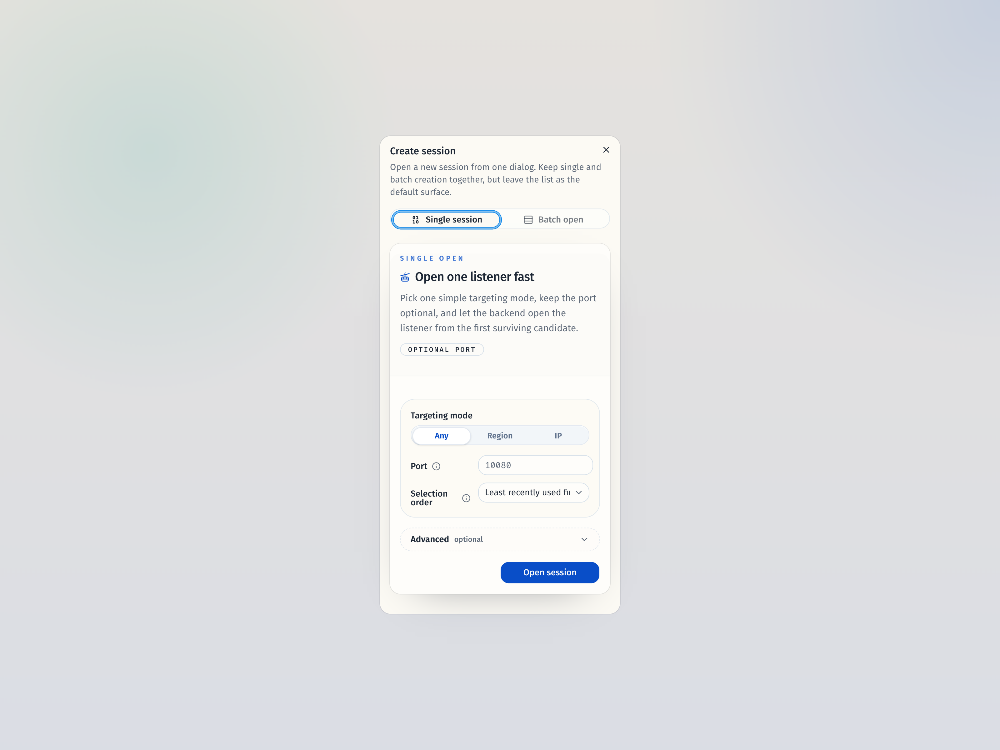
