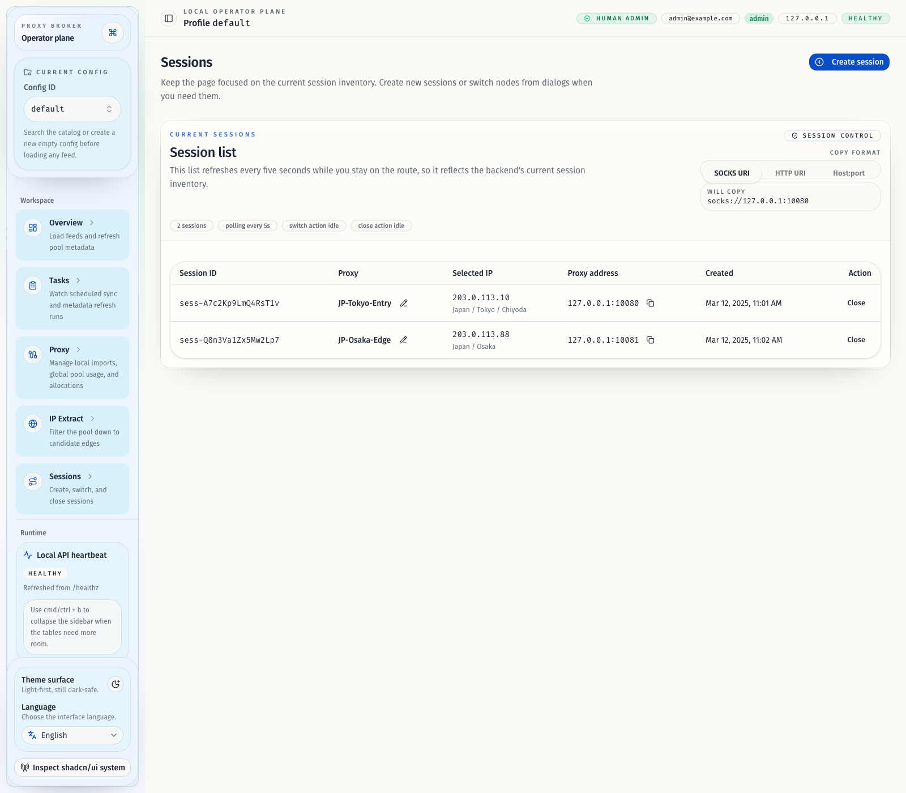

# 会话页列表优先与会话内切换代理（#2bsed）

## 状态

- Status: 已完成
- Created: 2026-04-24
- Last: 2026-04-25

## 背景 / 问题陈述

- `/sessions` 当前把创建入口与在线列表并排堆在首页，主次倒置，列表扫描效率低。
- 会话列表仍使用“活动监听 / 在线监听牌组”一类命名，不符合真实的会话运营语义。
- 当前会话创建后无法直接切换绑定节点，操作员只能关闭后重建，导致端口与监听地址不稳定。
- 节点选择缺少“当前会话最近使用 / 当前 profile 最近使用”的排序依据，重复运营成本高。

## 目标 / 非目标

### Goals

- 把 `/sessions` 重构成“会话列表优先”的页面，首页只保留列表与一个 `创建会话` 入口按钮。
- 把单个/批量创建收进统一弹窗，成功后自动关闭并刷新列表。
- 为每条会话增加切换代理入口，并允许在不改变 `session_id / listen / port` 的前提下切换节点。
- 新增节点 usage 持久化与查询接口，支持“当前会话最近使用 / 当前 profile 最近使用”两种排序。
- 为改动补齐 Storybook、交互覆盖与视觉证据，并推进到 PR merge-ready。

### Non-goals

- 不重做 `/proxies` 的 grouped node 运营页。
- 不新增“切换节点时再选择 IP”的二级交互。
- 不改变关闭会话语义，不自动 merge / cleanup。

## 需求（Requirements）

### MUST

- `/sessions` 首屏默认只展示页面标题、状态信息、会话列表与一个 `创建会话` 按钮。
- `创建会话` 弹窗必须保留“单个创建 / 批量创建”两种模式。
- 会话列表代理列必须提供 edit icon，并弹出可筛选、可排序的节点选择弹窗。
- 会话列表必须展示当前 selected IP 的国家/地区/城市摘要，并移除重复的 port badge。
- 会话列表上方必须提供一个带本地记忆的复制格式分段按钮，固定支持 `SOCKS URI`、`HTTP URI` 与 `主机:端口` 三种输出。
- 复制格式区域必须展示真实预览，直接反映当前会话将被复制出去的代理地址；不得把需求示例写死成产品文案。
- 会话列表必须把 owner-facing 地址与 runtime bind 地址分离：原始 bind host 只保留给运行时/诊断，默认表格展示与复制都使用可访问的 `display_address`。
- 当 bind host 为 `0.0.0.0` / `::` / `[::]` 时，owner-facing UI 不得直接展示通配地址；应优先使用 `session_public_host`，否则回退到当前页面 hostname。
- 当 bind host 为明确地址（例如域名、`192.168.*` 或 `127.0.0.1`）时，`display_address` 必须直接复用该 host，不得再被 UI 强制替换。
- 会话地址列必须在文本右侧提供复制 icon，按当前选择器格式复制完整代理地址。
- 会话关闭入口必须先进入 10 秒撤销窗口：点击后整行置灰、非撤销操作禁用、关闭按钮切换为撤销按钮，倒计时结束后才真正移除会话。
- 节点选择弹窗默认按 `当前会话最近使用` 排序，并支持切换到 `当前 profile 最近使用`。
- `PATCH /api/v1/profiles/{profile_id}/sessions/{session_id}/node` 必须保持 `session_id / listen / port / created_at` 不变，只更新 `node_id / proxy_name / selected_ip`。
- 创建会话与切换代理都必须更新 profile-scope 与 session-scope 的 node usage。

### SHOULD

- 节点筛选支持节点名、导入/来源名、primary IP、国家/地区/城市。
- 节点选择列表只展示当前 profile effective pool 内的可用节点。
- 新旧 usage 时间为空时统一排后，并以节点名升序作为稳定兜底。

## 验收标准（Acceptance Criteria）

- Given `/sessions` 首页
  When 页面首次加载
  Then 主体只展示会话列表与 `创建会话` 按钮，不再内联单个/批量创建表单。
- Given `创建会话` 弹窗
  When 单个或批量创建成功
  Then 弹窗自动关闭，列表刷新，失败时错误留在弹窗内。
- Given 一个已有会话
  When 操作员切换节点
  Then `session_id / listen / port` 保持不变，只更新节点与当前 IP。
- Given 会话列表中的 selected IP 列
  When 节点 metadata 已存在
  Then 列表显示国家 / 地区 / 城市摘要，且不再重复展示 port badge。
- Given 会话列表上方的复制格式选择器
  When 操作员切换到另一种地址格式
  Then 选择结果被保存在浏览器本地，固定可单击切换，并影响后续代理地址复制内容。
- Given 会话 bind host 为 wildcard
  When 页面通过某个可访问 hostname 打开当前管理台
  Then 列表主文案与复制结果使用 `session_public_host` 或当前页面 hostname，而不是 `0.0.0.0:*`。
- Given 会话 bind host 为明确地址
  When 列表或创建响应需要展示 owner-facing 地址
  Then `display_address` 直接复用该 host，不做 loopback 强制替换。
- Given 会话列表中的代理地址列
  When 操作员点击复制 icon
  Then 系统按当前选择器生成并复制完整代理地址，例如 `socks://ops.example.com:10080`、`http://192.168.31.15:10080` 或 `192.168.31.15:10080`。
- Given 会话列表中的关闭按钮
  When 操作员点击关闭
  Then 当前行先进入 10 秒撤销窗口并置灰，按钮切换为撤销；若未撤销，会话在 10 秒后消失。
- Given 节点选择弹窗
  When 在两种排序之间切换或输入关键词
  Then 列表按对应最近使用时间稳定排序，并只返回当前 profile 可见节点。

## 质量门槛（Quality Gates）

- `cargo test --lib`
- `cargo clippy --all-targets --all-features -- -D warnings`
- `cd web && bun run check`
- `cd web && bun run typecheck`
- `cd web && bun run test`
- `cd web && bun run verify:stories`
- `cd web && bun run build`
- `cd web && bun run build-storybook`
- `cd web && bun run test-storybook`
- `cd web && bun run test:e2e`

## Visual Evidence

- source_type: `storybook_canvas`
  story_id_or_title: `Pages/SessionsPage/Default`
  state: `default`
  evidence_note: 会话页首屏只保留会话列表与一个创建入口；selected IP 列展示地理摘要，原 port badge 已移除，列表上方改为固定可见的复制格式分段按钮与真实预览，代理地址列展示 `display_address` 并提供复制按钮。
  image:
  

- source_type: `storybook_canvas`
  story_id_or_title: `Pages/SessionsPage/CreateDialogFlow`
  state: `create dialog open`
  evidence_note: 创建会话入口收敛为弹窗，单个创建与批量创建统一进同一对话框。
  image:
  

- source_type: `storybook_canvas`
  story_id_or_title: `Pages/SessionsPage/SwitchDialogFlow`
  state: `switch dialog open`
  evidence_note: 会话内切换代理弹窗支持筛选输入与“当前会话最近使用”排序入口。
  image:
  

- source_type: `storybook_canvas`
  story_id_or_title: `Pages/SessionsPage/ClosingState`
  state: `close pending`
  evidence_note: 关闭动作先进入 10 秒撤销窗口；当前行整体置灰，关闭按钮切换为撤销，复制/编辑入口同步禁用。
  image:
  
