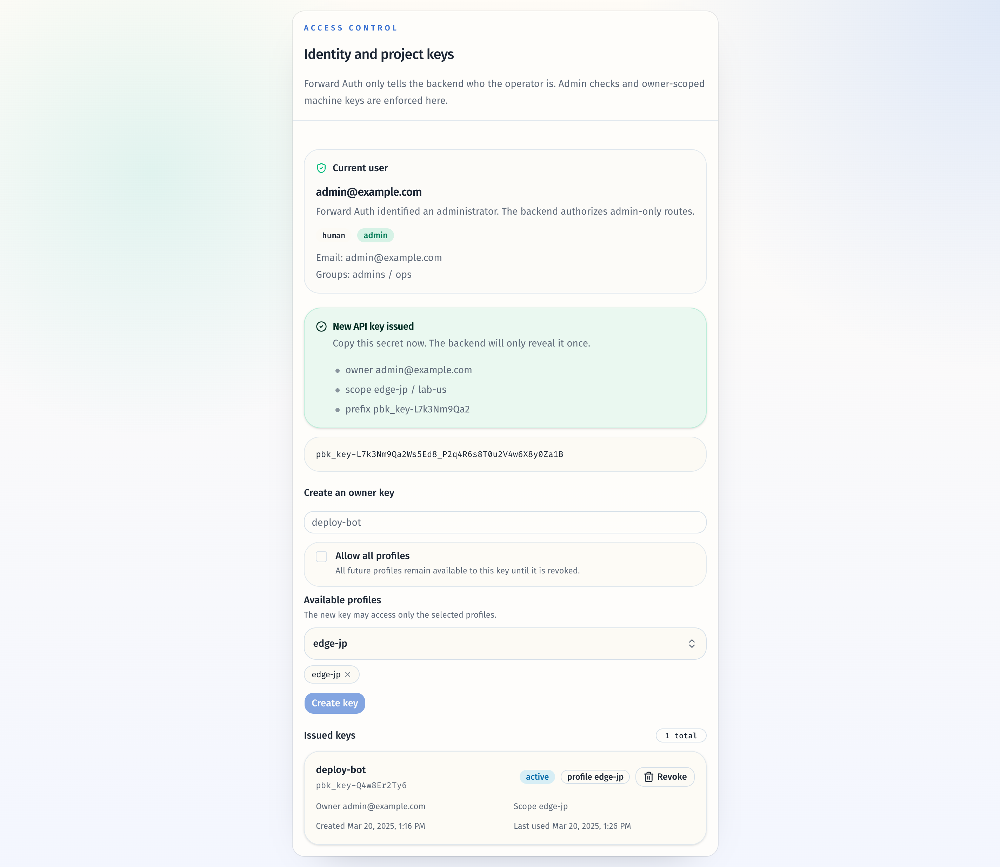

# 短 ID / NanoID 方案切换并移除主动 UUID 使用（#2e86e）

## 状态

- Status: 已完成
- Created: 2026-04-19
- Last: 2026-04-19

## 背景 / 问题陈述

- 当前仓库在运行期、持久化层与稳定派生命名里同时使用随机 UUID 与 UUIDv5；这让公开 ID 形状过长，也与“项目不得主动使用 UUID”的约束冲突。
- `session_id`、`run_id`、`event_id`、`key_id`、`import_id`、`node_id` 等字段已经对外暴露给 API、前端、测试夹具与文档；单纯局部替换会让存量 SQLite 数据与既有路径参数失配。
- `import_id`、`node_id`、`project_safe_name`、`broker-ip-*` 依赖“同输入 -> 同输出”的稳定映射；如果把它们误改成普通随机 ID，会破坏重复导入、节点追踪与运行时命名稳定性。
- 现有 API key 只落库存 `salt + sha256(secret)`，无法把历史 `pbk_<uuid>_<uuid>` secret 无损改写为新 `key_id`，所以必须明确历史 key 的处理策略。

## 目标 / 非目标

### Goals

- 用统一短 ID 方案替换项目内所有第一方 UUID 生成/派生逻辑，并把对外 ID 定义为 opaque short string。
- 随机 ID 改为 `nanoid` 风格短 ID；稳定 ID 改为基于 `sha256 + 共享 alphabet` 的确定性短 ID。
- 提供一次性 SQLite 数据迁移：把存量 `sessions` / `task_runs` / `task_run_events` / `proxy_imports` / `proxy_inventory_nodes` / `proxy_import_sync_configs` 改写为新短 ID。
- 历史 API keys 统一失效并要求重发，发布后项目不再主动生成或保留 UUID 形状的第一方 ID。
- 同步 README、共享 contracts、前端 fixtures/tests/stories，使示例和契约全部切换到新短 ID 口径。

### Non-goals

- 不改字段名、API 路由名或业务唯一性规则。
- 不为旧 UUID 路径参数提供发布后的兼容读取窗口。
- 不把 `docs/specs/**` 变成运行时依赖。

## 范围（Scope）

### In scope

- Rust 后端的统一 ID helper、SQLite 迁移、认证/API key 逻辑、运行时命名与相关测试。
- 前端类型、fixtures、stories、测试数据与共享文档中的 ID 示例更新。
- 新增一条 specs work item 记录本次迁移契约，并在实现过程中保持同步。

### Out of scope

- 新增 UUID/短 ID 双栈兼容层。
- 变更 project 自定义 ID 的输入语义。
- UI 视觉布局或交互重构。

## 需求（Requirements）

### MUST

- 共享 alphabet 固定为 `0-9A-Za-z`，且所有第一方随机/稳定短 ID 都只能使用这一 alphabet。
- `session_id` / `run_id` / `event_id` / `import_id` / `node_id` / `key_id` 对外仍保持 string 字段，但不再声明或示例化 UUID 形状。
- `import_id`、`node_id`、`project_safe_name`、`broker-ip-*` 必须继续满足“同输入 -> 同输出”。
- SQLite 升级后，所有相关表之间的 ID 关联必须完整指向新短 ID。
- 历史 API keys 必须在迁移中统一清空或撤销，迁移后旧 secret 不能再认证成功。
- `Cargo.toml` 与第一方源码中不得残留 `uuid` 依赖和 `Uuid::new_v4/new_v5/NAMESPACE_URL` 调用。

### SHOULD

- 新 ID helper 应集中在一个模块中，避免散落命名空间常量和 prefix 规则。
- 迁移逻辑应可重复执行而不重复改写已经符合新形状的记录。
- 测试应显式覆盖随机 ID 形状、稳定 ID 一致性、API key 解析与 SQLite 迁移回归。

### COULD

- 为 temp file suffix 与测试临时数据库路径也复用相同的随机短 token helper。

## 功能与行为规格（Functional/Behavior Spec）

### Core flows

- 服务生成新的 session / task run / task event / manual import / API key 时，改为生成带固定前缀的短 ID。
- 服务根据订阅来源、节点名、project ID 或 `(proxy_name, ip)` 派生稳定标识时，改为输出确定性的短 ID，但业务判定依据保持不变。
- 旧 SQLite 库首次升级时，服务会在现有 schema repair/backfill 后继续执行短 ID 改写，把相关记录和引用迁移到新形状。
- API key 创建接口继续返回 `pbk_<key_id>_<random>` 形状的 secret，但 `key_id` 与随机段都改为 underscore-safe 的短 ID 片段。

### Edge cases / errors

- 已经符合新短 ID 形状的记录在重复执行迁移时不得再次被改写。
- manual import 的 `source_type=manual` 需要把 `source_value` 与新的 `import_id` 一起改写，避免 source identity 漂移。
- 如果旧数据库中历史 API key 被清空后列表为空，管理台与 API 返回应保持正常空态，不报错。
- 若历史 UUID 路径参数在迁移后继续被调用，请求按“找不到对应记录”处理，不做兼容映射。

## 接口契约（Interfaces & Contracts）

### 接口清单（Inventory）

| 接口（Name） | 类型（Kind） | 范围（Scope） | 变更（Change） | 契约文档（Contract Doc） | 负责人（Owner） | 使用方（Consumers） | 备注（Notes） |
| --- | --- | --- | --- | --- | --- | --- | --- |
| Session / Task / API Key / Proxy import ID fields | HTTP API | external | Modify | `../../contracts/http-apis.md` | backend | web UI / API clients | 仅改变 ID 词法形状，不改字段名 |
| SQLite persisted IDs | DB | internal | Modify | `../../contracts/db.md` | backend | sqlite store / migration tests | 一次性迁移所有相关表 |
| Mihomo listener / proxy naming | File format | internal | Modify | `../../contracts/file-formats.md` | backend | runtime / config render | `broker-<session_id>` 与 `broker-ip-<hash>` 仍保持稳定语义 |

### 契约文档（按 Kind 拆分）

- 复用仓库共享契约文档：`docs/contracts/http-apis.md`、`docs/contracts/db.md`、`docs/contracts/file-formats.md`。
- 本计划不新增独立协议文件；实现完成后直接同步上述共享 contracts。

## 验收标准（Acceptance Criteria）

- Given 现有代码库仍包含 UUID 生成逻辑
  When 完成本次改造并执行仓库搜索
  Then 第一方源码与 `Cargo.toml` 中不再存在主动生成/派生 UUID 的实现或 `uuid` 直接依赖。

- Given 一个旧 SQLite 库包含 UUID 形状的 session/run/event/import/node 记录
  When 服务以新版本打开数据库
  Then 相关表中的记录与交叉引用全部被改写为新短 ID，且原有业务关系保持可用。

- Given 一个稳定来源的订阅导入或节点
  When 服务重复按相同来源材料计算其 ID
  Then 得到的短 ID 与运行时命名保持稳定一致。

- Given 迁移前存在历史 API keys
  When 新版本启动完成迁移
  Then 历史 key 不再能认证成功，管理员新创建的 API key 返回新短 ID 形状 secret 并可正常认证。

- Given 前端 fixtures、stories 与共享文档引用这些 ID
  When 实现完成并同步 docs/tests
  Then 示例不再展示 UUID 形状，且前端类型与测试仍全部通过。

## 实现前置条件（Definition of Ready / Preconditions）

- 目标/非目标、范围（in/out）、约束已明确
- 验收标准覆盖 core path + 关键边界/异常
- 接口契约已定稿（复用共享 `docs/contracts/**`），实现与测试可以直接按契约落地
- 关键取舍已锁定：稳定 ID 继续稳定；旧 UUID 不兼容；历史 API key 统一失效并重发
- 资产晋升为 `None`

## 非功能性验收 / 质量门槛（Quality Gates）

### Testing

- Unit tests: ID helper、API key parser、task/session 排序与稳定命名测试
- Integration tests: SQLite 迁移回归、API key create/list/revoke、session open/list/close、proxy import/inventory 流程
- E2E tests (if applicable): 保持 smoke fixtures 与管理台基础流程通过

### UI / Storybook (if applicable)

- Stories to add/update:
  - `web/src/features/overview/components/AccessControlCard.stories.tsx`
  - `web/src/components/CurrentUserSummary.stories.tsx`
  - `web/src/pages/OverviewPage.stories.tsx`
  - `web/src/pages/ProxiesPage.stories.tsx`
- Docs pages / state galleries to add/update: 复用现有 autodocs / canvas 入口
- `play` / interaction coverage to add/update: None
- Visual regression baseline changes (if any): Storybook canvas 示例已切换到新短 ID 形状

### Quality checks

- Lint / typecheck / formatting: `cargo fmt`, `cargo test`, `bun test`, `bun typecheck`

## 文档更新（Docs to Update）

- `README.md`: 更新 API key 示例与短 ID 说明
- `docs/contracts/http-apis.md`: 更新公开 ID 字段与 API key secret 口径
- `docs/contracts/db.md`: 记录 SQLite 持久化 ID 已切换到短 ID 与 API key 清空策略
- `docs/contracts/file-formats.md`: 更新 `broker-ip-*` 与 listener naming 描述

## 计划资产（Plan assets）

- Directory: `docs/specs/2e86e-short-id-without-uuid/assets/`
- In-plan references: ``
- Visual evidence source: maintain `## Visual Evidence` in this spec when owner-facing or PR-facing screenshots are needed.
- If an asset must be used in impl (runtime/test/official docs), list it in `资产晋升（Asset promotion）` and promote it to a stable project path during implementation.

## Visual Evidence

- Storybook canvas：`Features/Overview/AccessControlCard -> With Fresh Secret`
  
- Storybook canvas：`Components/CurrentUserSummary -> Api Key Machine`
  

## 资产晋升（Asset promotion）

None

## 实现里程碑（Milestones / Delivery checklist）

- [x] M1: 新增统一短 ID helper，并替换所有第一方 UUID 随机/稳定生成入口
- [x] M2: 完成 SQLite 一次性迁移、历史 API key 失效策略与后端回归测试
- [x] M3: 同步共享 contracts / README / 前端 fixtures/tests，并完成快车道收敛到 merge-ready

## 方案概述（Approach, high-level）

- 在 Rust 侧新增集中式 ID 模块，统一封装 alphabet、prefix、随机生成与稳定派生逻辑。
- 随机 ID 使用 `nanoid` 风格短 body；稳定 ID 使用 `sha256(namespace + material)` 摘要后编码到同一 alphabet，并按固定长度截断。
- SQLite 迁移以“按类别重写 + 引用表联动更新”为原则，stable import/node 直接按当前业务材料重算，manual import 与旧 random IDs 只在仍是 legacy 形状时改写一次。
- 前端与文档层把 ID 视为 opaque string，只同步示例与契约，不引入格式依赖。

## 风险 / 开放问题 / 假设（Risks, Open Questions, Assumptions）

- 风险：SQLite 改写涉及多表引用，若映射顺序错误会导致 import/node/task event 脱链。
- 风险：历史 API key 统一失效会影响已有自动化调用，发布说明必须明确要求重发。
- 需要决策的问题：None（主人已锁定稳定 ID、无 UUID 兼容窗口与 API key 重发策略）
- 假设（需主人确认）：None

## 变更记录（Change log）

- 2026-04-19: 新建规格，锁定“稳定短 ID + 禁止主动使用 UUID + 旧 API key 统一失效并重发”的迁移契约。
- 2026-04-19: 已落地统一 `src/ids.rs`、SQLite 一次性改写、API key 短 ID/重发策略，以及前端 fixtures / stories / smoke data 同步；补充 Storybook 视觉证据。
- 2026-04-19: 修复迁移清理 legacy API key 时遗漏 `api_key_projects` 残留的问题，并完成 PR #37 的 review、CI 与 spec drift 收口。

## 参考（References）

- `docs/contracts/http-apis.md`
- `docs/contracts/db.md`
- `docs/contracts/file-formats.md`
- `docs/specs/h2w7p-forward-auth-admin-and-project-keys/SPEC.md`
- `docs/specs/qvbmc-proxy-import-allocation/SPEC.md`
- `docs/specs/y5yx8-task-module-and-auto-subscription-maintenance/SPEC.md`
