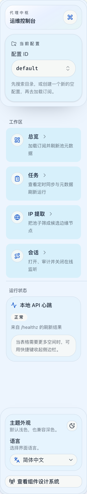

# AppShell workspace 卡片间距修复（#4jfey）

## 状态

- Status: 已完成
- Created: 2026-04-01
- Last: 2026-04-01

## 背景 / 问题陈述

- AppShell 侧栏的工作区导航卡片当前垂直节奏丢失，`总览 / 任务 / IP 提取 / 会话` 四张卡片在展开态下紧贴在一起，扫描层级变差。
- 这个问题出现在共享侧栏原语之上的局部装配层，而不是全局 `SidebarMenu` 默认契约本身。
- 若不修复，控制台首屏的主导航会持续显得拥挤，和现有 light-first 控制室视觉语言不一致。

## 目标 / 非目标

### Goals

- 恢复 AppShell 工作区导航卡片在展开态下的明确垂直间距。
- 保持共享 `SidebarMenu` 原语默认值不变，只在 AppShell 里做局部修复。
- 用 `Components/AppShell > ZhCN` 作为稳定 Storybook 验收面，并补齐可复用的视觉证据。

### Non-goals

- 不重做 AppShell 的图标、配色、文案或整体信息架构。
- 不修改 Overview、Tasks、IP Extract、Sessions 页面主体布局。
- 不新增或修改任何后端、HTTP、数据结构或类型合同。

## 范围（Scope）

### In scope

- `/web/src/components/AppShell.tsx` 的工作区卡片栈 spacing 调整。
- `/web/src/components/AppShell.stories.tsx` 的 Storybook 覆盖与 `play` 验证。
- 本规格自身、索引和 `## Visual Evidence` 的同步。

### Out of scope

- `web/src/components/ui/sidebar.tsx` 的共享原语默认样式变更。
- 非 AppShell 入口的 sidebar/list spacing 调整。

## 需求（Requirements）

### MUST

- Expanded sidebar 中四张工作区卡片之间必须有明确可感知的垂直间距，不能再视觉粘连。
- 修复必须局限在 AppShell 装配层，不能改动共享 `SidebarMenu` 默认 `gap-0`。
- Storybook `Components/AppShell` 必须继续保留 autodocs，并增加至少一条可执行 `play` 覆盖来守护导航卡片栈。
- 最终视觉证据必须来自 Storybook，写入本 spec 的 `## Visual Evidence`。

### SHOULD

- Collapsed icon 状态保持紧凑但不拥挤，不把展开态 spacing 原样放大成新的视觉负担。
- 验证应覆盖 zh-CN 文案环境，因为问题在中文侧栏截图中被发现。

### COULD

- 在 Storybook `play` 中直接校验卡片之间存在正向垂直间距，以减少未来回归。

## 功能与行为规格（Functional/Behavior Spec）

### Core flows

- 在桌面展开态打开 AppShell 时，工作区分组中的四张导航卡片按统一节奏垂直排布。
- 每张卡片继续保留现有 hover、active、focus、icon 和说明文案排版，不因加间距而改变点击命中区。
- `Components/AppShell > ZhCN` 故事继续作为本地视觉审阅入口，并能通过 `play` 证明导航栈存在稳定分隔。

### Edge cases / errors

- 侧栏折叠为 icon 模式时仍应可用；允许比展开态更紧凑，但不能出现重叠、裁切或错位。
- 移动端 sheet 侧栏不新增独立布局分支；本次修复只能沿用已有导航组件结构。

## 接口契约（Interfaces & Contracts）

### 接口清单（Inventory）

| 接口（Name） | 类型（Kind） | 范围（Scope） | 变更（Change） | 契约文档（Contract Doc） | 负责人（Owner） | 使用方（Consumers） | 备注（Notes） |
| --- | --- | --- | --- | --- | --- | --- | --- |
| None | None | internal | Modify | None | web | operator console | 无公开接口变化 |

### 契约文档（按 Kind 拆分）

None

## 验收标准（Acceptance Criteria）

- Given `Components/AppShell > ZhCN` 以展开态渲染
  When 检查工作区导航栈
  Then `总览 / 任务 / IP 提取 / 会话` 四张卡片之间存在明确正向垂直间距，且不再视觉粘连。

- Given 侧栏导航卡片存在 hover、active 或 focus 状态
  When 用户在工作区卡片之间移动或切换当前路由
  Then 文本、图标、边框和点击命中区保持对齐，不出现裁切或布局跳变。

- Given Storybook 运行 `Components/AppShell` 故事
  When 执行 `play` 覆盖
  Then 测试能够证明工作区导航项存在且卡片间距为正值。

## 实现前置条件（Definition of Ready / Preconditions）

- 问题已定位在 AppShell 的工作区装配层，而不是共享 sidebar 原语。
- Storybook 已在仓库中可用，且 `Components/AppShell` 已有可复用故事入口。
- 不涉及接口、schema 或运行时合同变更。

## 非功能性验收 / 质量门槛（Quality Gates）

### Testing

- Unit tests: 复用现有 Vitest 套件，无需新增独立单测文件。
- Integration tests: 不适用。
- E2E tests (if applicable): 不适用。

### UI / Storybook (if applicable)

- Stories to add/update: `web/src/components/AppShell.stories.tsx`
- Docs pages / state galleries to add/update: 使用现有 autodocs，无需新增 MDX。
- `play` / interaction coverage to add/update: 为 zh-CN AppShell 导航栈增加间距守护。
- Visual regression baseline changes (if any): 以 Storybook canvas 截图为准。

### Quality checks

- Lint / typecheck / formatting: `bun run check`, `bun run typecheck`, `bun run test`, `bun run verify:stories`, `bun run test-storybook`, `bun run build`

## 文档更新（Docs to Update）

- `docs/specs/README.md`: 新增索引并同步状态。
- `docs/specs/4jfey-appshell-workspace-card-spacing/SPEC.md`: 维护规格、验收和视觉证据。

## 计划资产（Plan assets）

- Directory: `docs/specs/4jfey-appshell-workspace-card-spacing/assets/`
- In-plan references: ``
- Visual evidence source: maintain `## Visual Evidence` in this spec when owner-facing or PR-facing screenshots are needed.
- If an asset must be used in impl (runtime/test/official docs), list it in `资产晋升（Asset promotion）` and promote it to a stable project path during implementation.

## Visual Evidence

- `source_type=storybook_canvas`
- `target_program=mock-only`
- `capture_scope=element`
- `sensitive_exclusion=N/A`
- `submission_gate=pending-owner-approval`
- `story_id_or_title=Components/AppShell/ZhCN`
- `state=expanded workspace navigation deck`
- `evidence_note=Shows the AppShell sidebar with restored vertical spacing between the Overview, Tasks, IP Extract, and Sessions cards while keeping the runtime and footer blocks aligned.`

## 资产晋升（Asset promotion）

None

## 实现里程碑（Milestones / Delivery checklist）

- [x] M1: AppShell 工作区导航卡片栈恢复明确垂直间距，且不改共享 `SidebarMenu` 默认契约。
- [x] M2: AppShell Storybook 覆盖补齐 `play` 守护，zh-CN 视图可稳定复现修复结果。
- [x] M3: 质量检查、视觉证据与规格索引同步完成，可作为 PR 就绪的本地证明。

## 方案概述（Approach, high-level）

- 通过 AppShell 调用点覆写导航列表节奏，而不回写 `SidebarMenu` 基元默认值。
- 沿用现有 `Components/AppShell` story 作为视觉验收主入口，直接在故事层守护导航卡片栈。
- 最终证据统一落到本 spec 的 `assets/` 与 `## Visual Evidence`。

## 风险 / 开放问题 / 假设（Risks, Open Questions, Assumptions）

- 风险：如果展开态与折叠态共用同一 spacing 值，可能让 icon-only 模式显得过松。
- 需要决策的问题：None。
- 假设（需主人确认）：展开态以现有控制室节奏补回一档清晰 spacing，折叠态只做回归校验。

## 变更记录（Change log）

- 2026-04-01: 创建 follow-up spec，冻结 AppShell 工作区卡片间距修复范围与验收口径。
- 2026-04-01: 完成 AppShell 局部间距修复、Storybook `play` 守护与 owner-facing 视觉证据同步。

## 参考（References）

- `docs/specs/s3zu5-admin-ui-refresh/SPEC.md`
- `web/src/components/AppShell.tsx`
- `web/src/components/AppShell.stories.tsx`
