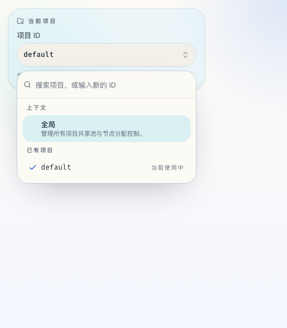
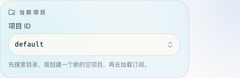

# Project Catalog And Combobox（#6b2xu）

## 状态

- Status: 已完成
- Created: 2026-03-19
- Last: 2026-05-08

## 背景 / 问题陈述

- 当前侧栏的 `Project ID` 只是自由文本输入，缺少已存在 project 的可发现性，也缺少明确的新建动作。
- 后端公开合约统一使用 project 术语：项目 catalog 与项目作用域业务 API 都以 `project_id` 为边界。
- SQLite 的 `list_projects()` 仅从业务数据表做 `UNION`，无法持久化“刚创建、但还没有订阅/会话数据”的空 project。

## 目标 / 非目标

### Goals

- 提供可下拉、可搜索、可显式新增的 project selector。
- 为空 project 引入真实可持久化的 project catalog。
- 保持现有 load / refresh / extract / sessions 行为不变，只将公开命名边界统一到 `project_id`。

### Non-goals

- 不做 project rename、delete、批量管理或 MRU 排序。
- 不改变代理池、会话、任务调度、刷新和导入的业务语义。

## 范围（Scope）

### In scope

- 新增 `GET /api/v1/projects` 与 `POST /api/v1/projects`。
- 将历史 `/api/v1/profiles/{profile_id}/...` 公开路由迁移为 `/api/v1/projects/{project_id}/...`。
- 新增 project catalog 存储与空 project 持久化。
- 将侧栏 `Project ID` 改为 anchored combobox，支持搜索与显式创建。
- 更新相关 stories、单测、路由测试与 e2e smoke。

### Out of scope

- 新增 project 权限、标签、描述等元数据。
- 改变现有页面对 `projectId` 的 query key 设计。
- 保留旧 `/api/v1/profiles` 作为公开兼容入口。

## 需求（Requirements）

### MUST

- 已存在 project 可以在下拉中搜索并选择。
- 不存在的 project 可以通过明确的 create action 创建。
- 新创建但尚无业务数据的 project 刷新后仍可列出。
- 创建入口只做 `trim + non-empty` 校验；精确重名返回冲突。

### SHOULD

- 当前已选但暂未出现在后端列表里的 `projectId` 仍应保留在候选中，避免上下文丢失。
- 组件支持键盘导航、回车选择、回车创建与清晰的 loading/empty/error 状态。

### COULD

- 创建成功后给出轻量 toast 反馈。

## 功能与行为规格（Functional/Behavior Spec）

### Core flows

- 打开侧栏 selector 时，显示当前 active project、搜索输入框与 project 列表。
- 输入关键字后，列表实时过滤；匹配项为空时，显示空状态和 `Create "<query>"` 操作。
- 选择已有 project 时，立即切换 active project，关闭下拉，并让后续路由请求使用新的 `projectId`。
- 创建新 project 成功后，立即切换到该 project、刷新候选列表，并保持当前路由上下文。

### Edge cases / errors

- 输入仅空白字符时，不允许创建。
- 创建已存在的 project 时，前端展示可恢复错误，并重新拉取列表与现有值对齐。
- projects 列表请求失败时，不阻断当前已选 project 的使用；selector 展示失败提示并允许重试。

## 接口契约（Interfaces & Contracts）

### 接口清单（Inventory）

| 接口（Name） | 类型（Kind） | 范围（Scope） | 变更（Change） | 契约文档（Contract Doc） | 负责人（Owner） | 使用方（Consumers） | 备注（Notes） |
| --- | --- | --- | --- | --- | --- | --- | --- |
| Project catalog HTTP API | HTTP | external | New | ./contracts/http-apis.md | proxy-broker | web admin UI | 列表与创建 |
| Project catalog persistence | DB | internal | New | ./contracts/db.md | proxy-broker | Rust store/service | 支持空 project 持久化 |

### 契约文档（按 Kind 拆分）

- [contracts/README.md](./contracts/README.md)
- [contracts/http-apis.md](./contracts/http-apis.md)
- [contracts/db.md](./contracts/db.md)

## 验收标准（Acceptance Criteria）

- Given 已有 `default` 与 `edge-jp` 两个 project
  When 操作员打开 selector 并输入 `jp`
  Then 下拉只显示 `edge-jp` 且可直接选中。
- Given `fresh-lab` 尚不存在
  When 操作员在 selector 中执行 create
  Then 后端返回 201、active project 切换到 `fresh-lab`，刷新页面后它仍在列表中。
- Given `POST /api/v1/projects` 收到空白 `project_id`
  When 请求到达后端
  Then 返回 `400 invalid_request`。
- Given `POST /api/v1/projects` 收到已存在的 `project_id`
  When 请求到达后端
  Then 返回 `409 project_exists`，前端保留可恢复状态。

## 实现前置条件（Definition of Ready / Preconditions）

- 目标、范围与非目标已冻结。
- 空 project 需要真实持久化而不是前端假列表，这一点已确认。
- 新增 HTTP contract 与 SQLite schema 变更已接受。

## 非功能性验收 / 质量门槛（Quality Gates）

### Testing

- Unit tests: store/service 校验、前端 selector 行为。
- Integration tests: Axum router 的 projects list/create 路由。
- E2E tests (if applicable): smoke 覆盖选择已有 project 与创建新 project。

### UI / Storybook (if applicable)

- Stories to add/update: `ProjectSwitcher` 的 default、populated、search-no-match、creating。
- `play` / interaction coverage to add/update: selector 打开、过滤、创建。

### Quality checks

- `cargo test`
- `bun run check`
- `bun run typecheck`
- `bun run test`
- `bun run verify:stories`
- `bun run build`
- `bun run test:e2e`

## 文档更新（Docs to Update）

- `docs/contracts/http-apis.md`: 记录新的 projects list/create endpoint。
- `docs/contracts/rust-api.md`: 补充 store/service contract。
- `docs/contracts/db.md`: 记录新的 `projects` 表。
- `docs/specs/README.md`: 新增并更新规格台账。

## 计划资产（Plan assets）

- Directory: `docs/specs/6b2xu-project-catalog-combobox/assets/`
- In-plan references: ``
- PR visual evidence source: maintain `## Visual Evidence (PR)` in this spec when PR screenshots are needed.

## Visual Evidence

- source_type: storybook_canvas
- target_program: mock-only
- capture_scope: browser-viewport
- requested_viewport: 560x640
- viewport_strategy: devtools-emulate
- sensitive_exclusion: N/A
- submission_gate: pending-owner-approval
- story_id_or_title: Components/ProjectSwitcher/SearchNoMatch
- state: expanded catalog
- evidence_note: 验证侧栏 active project 控件显示 `当前项目 / 项目 ID`，并能展开为可搜索、可创建的 anchored combobox。

- source_type: storybook_canvas
- target_program: mock-only
- capture_scope: element
- requested_viewport: 520x520
- viewport_strategy: devtools-emulate
- sensitive_exclusion: N/A
- submission_gate: pending-owner-approval
- story_id_or_title: Components/ProjectSwitcher/Populated
- state: collapsed selector
- evidence_note: 验证 active project 控件在默认静态态下显示 `当前项目 / 项目 ID`，不再出现配置/profile 心智。

## 资产晋升（Asset promotion）

None

## 实现里程碑（Milestones / Delivery checklist）

- [x] M1: 新 spec、contracts 与全局文档索引完成更新。
- [x] M2: Rust store / service / HTTP 完成 project catalog 支持。
- [x] M3: Web `ProjectSwitcher` 完成 searchable + creatable combobox 改造。
- [x] M4: Stories、单测、e2e 与验证脚本全部通过。

## 方案概述（Approach, high-level）

- 为 SQLite 增加独立 `projects` 表，并让 `list_projects()` 同时兼容历史业务表中的 project。
- 启动迁移会把旧 `profiles` 表和 `profile_id` 列重命名到 project 形状，保留旧数据。
- 在 Rust API 中引入显式 list/create contract，让 Web UI 不再依赖隐式输入新值。
- 前端 selector 采用 `Popover + Command` 组合，保持 props-driven 与 Storybook 友好。

## 风险 / 开放问题 / 假设（Risks, Open Questions, Assumptions）

- 风险：旧数据仓库可能仍是 `profiles/profile_id` schema，迁移必须保持向后兼容。
- 需要决策的问题：None。
- 假设（需主人确认）：project ID 继续保持宽松语义，不新增字符集限制。

## 变更记录（Change log）

- 2026-03-19: 初始规格，冻结 project catalog 与 combobox 方案。
- 2026-03-19: 实现完成，projects catalog、combobox 与验证闭环全部落地。
- 2026-05-08: 公开合约、存储命名与 Web 管理台术语从 profile/config 全栈迁移到 project。

## 参考（References）

- `docs/specs/web-admin-ui.md`
- `docs/specs/s3zu5-admin-ui-refresh/SPEC.md`
