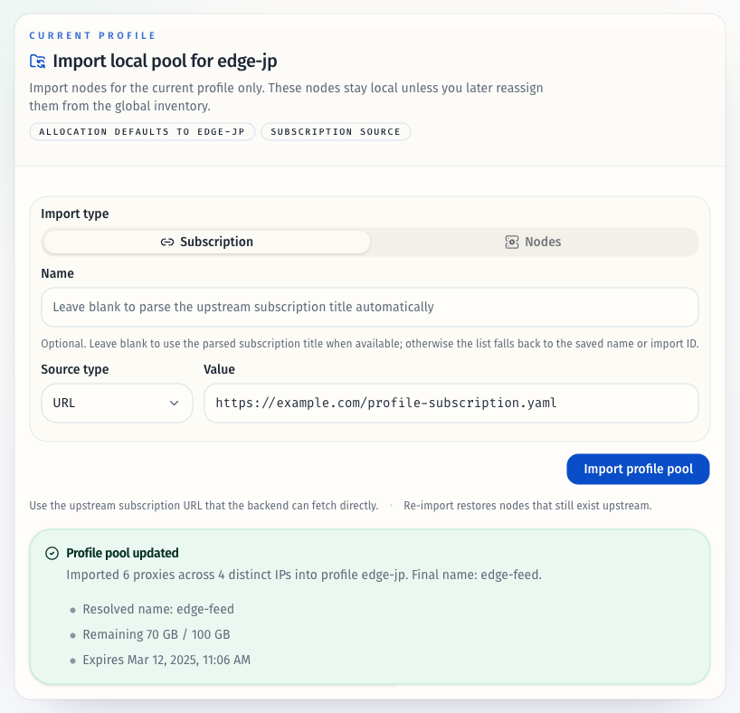
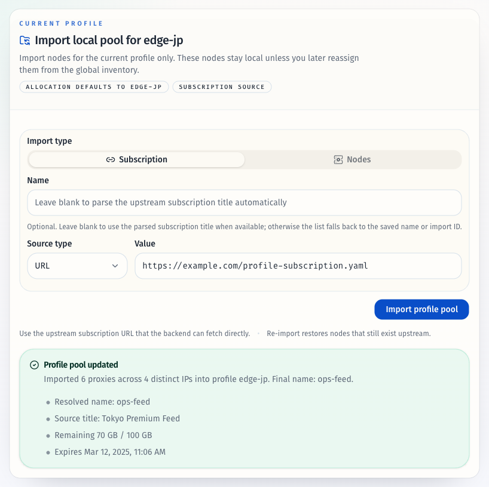
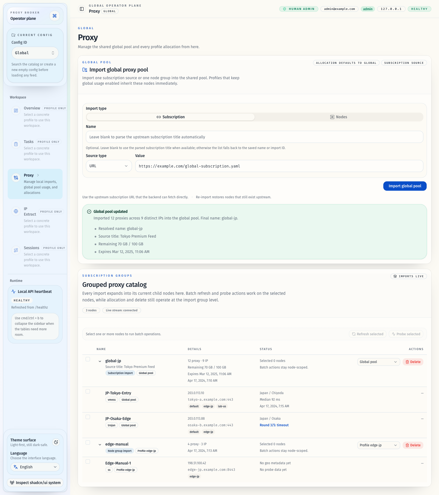

# 订阅元信息解析、信息节点过滤与导入名称自动补全（#9hv34）

## 状态

- Status: 已完成
- Created: 2026-04-22
- Last: 2026-04-22

## 背景 / 问题陈述

- 当前 source-based 订阅导入只解析节点，不会保留上游响应头中的订阅标题、流量、到期等元信息。
- `/proxies` 当前只能展示导入名、节点数与 IP 数，无法持续看到订阅剩余流量、总流量或到期时间。
- 导入名称目前主要依赖显式输入或前端 URL hostname 推断，无法对齐 Mihomo 生态中常见的 `profile-title` / `Content-Disposition` 语义。
- 部分订阅会把“流量说明 / 到期提醒 / 官网公告”伪装成节点返回，当前会直接混入 inventory。

## 目标 / 非目标

### Goals

- 为 source-based 订阅导入解析并持久化订阅标题、流量、到期等 import 级元信息。
- 导入成功响应与 `/proxies` grouped import 行都能展示这些订阅元信息。
- 固定导入名称优先级为“显式手填 > 既有持久名称 > 解析名称”，并在空白名称时自动采用解析名称。
- 对 source-based 订阅导入新增保守的信息节点过滤，并把过滤结果写入 warnings。
- 为本次 UI 改动补齐 Storybook 入口、交互覆盖与视觉证据，推进到 PR merge-ready。

### Non-goals

- 不提供可配置的信息节点过滤规则或 UI 开关。
- 不修改 Mihomo runtime、本地会话/测速流程、allocation 语义或自动同步调度策略。
- 不对手工节点组导入启用信息节点过滤。
- 不把本次展示扩展到 `/proxies` 以外的新页面。

## 范围（Scope）

### In scope

- `src/subscription.rs`：解析 `subscription-userinfo`、`profile-title`（含 `base64:`）、`Content-Disposition`、URL/文件名回退，并兼容 `x-*-meta-subscription-userinfo`。
- `src/service.rs` / `src/models.rs` / `src/store/*`：新增 import 级 `subscription_metadata`、名称解析结果、保守信息节点过滤 warning、SQLite additive migration。
- `src/api.rs` / `web/src/lib/types.ts`：扩展 `LoadSubscriptionResponse` 与 `ProxyImportItem` 契约。
- `web/src/features/proxies/components/ProxyLoadCard.tsx`、`web/src/features/overview/components/SubscriptionFormCard.tsx`、`web/src/pages/ProxiesPage.tsx`：展示解析名称、订阅元信息与 filtering warnings。
- `web/src/**/*.stories.tsx` 与视觉证据：至少覆盖“带元信息成功态”“手填名优先”“解析名回退”“信息节点 warning”。

### Out of scope

- 订阅元信息的用户编辑能力。
- 运行时流量统计替代或 project/task 概览页扩展。
- 非订阅来源（manual node group）的 source title / traffic / expire 解析。

## 需求（Requirements）

### MUST

- URL 订阅优先从 `profile-title` 解析名称，其次 `Content-Disposition filename/filename*`，再回退到 URL/文件名。
- `subscription-userinfo` 的 `upload/download/total/expire` 必须转换为 `used_bytes / remaining_bytes / expire_at`，并持久化到 import 元信息。
- `LoadSubscriptionResponse` 必须返回 `resolved_name`、`resolved_name_source`、`subscription_metadata`。
- `ProxyImportItem` 必须返回持久化 `subscription_metadata`，供 `/proxies` grouped import 行持续展示。
- source-based 订阅导入命中保守说明类关键词时，相关节点不得写入 inventory，且 warnings 可见。
- 当显式输入名称为空、既有 import.name 也为空时，导入成功后应自动采用解析名称作为 import.name。

### SHOULD

- 当 `name` 与 `subscription_metadata.source_title` 不同时，UI 以次级信息展示原始订阅标题。
- 旧 SQLite 库升级后应平滑补齐新列，历史 import 在无元信息时返回 `null` 而不是报错。
- 文件订阅在没有响应头时，应使用 basename/file stem 作为解析名称回退。

### COULD

- 内部保留 `project-update-interval` 解析结果，为后续自动同步策略扩展做准备，但首版不要求展示。

## 功能与行为规格（Functional/Behavior Spec）

### Core flows

- source-based 导入时，subscription loader 先解析 body/header 元信息，再过滤信息节点，最后才执行 DNS 与 inventory upsert。
- import persistence 会把 source-derived title、流量/到期摘要与解析名称一起落到 `proxy_imports` 对应 import。
- `resolved_name_source` 只反映“本次最终采用的 import 名称来源”，不改变 `subscription_metadata.source_title` 的原始含义。
- `/proxies` import 行在详情列显示：剩余流量 / 总流量、到期时间；若解析出 source title 且与主名称不同，则显示次级标题。
- 导入成功卡片复用同一批 `subscription_metadata`，不再依赖前端自行从 URL hostname 生成名称。

### Edge cases / errors

- 若 payload 可解析但过滤后没有有效节点，返回 `subscription_invalid`。
- `subscription-userinfo`、`profile-title`、`Content-Disposition` 任一头非法时，不中断导入；只跳过该字段并写 warning（若需要）。
- 旧 import 已有名称时，再次导入即便解析出新标题，也不得覆盖该既有名称；只更新 `subscription_metadata.source_title`。
- 手工节点组导入保留现有首节点名自动生成逻辑，不注入 source metadata，也不做信息节点过滤。

## 接口契约（Interfaces & Contracts）

### 接口清单（Inventory）

| 接口（Name） | 类型（Kind） | 范围（Scope） | 变更（Change） | 契约文档（Contract Doc） | 负责人（Owner） | 使用方（Consumers） | 备注（Notes） |
| --- | --- | --- | --- | --- | --- | --- | --- |
| Subscription load response | HTTP | external | Modify | ./contracts/http-apis.md | proxy-broker | web load cards | 新增 `resolved_name` / `resolved_name_source` / `subscription_metadata` |
| Proxy import persistence | DB | internal | Modify | ./contracts/db.md | proxy-broker | store/service/tests | `proxy_imports` 新增订阅元信息列 |
| Subscription loader / import service | Rust API | internal | Modify | ./contracts/rust-api.md | proxy-broker | api/service/tests | 统一返回节点 + warning + metadata |

### 契约文档（按 Kind 拆分）

- [contracts/README.md](./contracts/README.md)
- [contracts/http-apis.md](./contracts/http-apis.md)
- [contracts/db.md](./contracts/db.md)
- [contracts/rust-api.md](./contracts/rust-api.md)

## 验收标准（Acceptance Criteria）

- Given URL 订阅响应头含 `profile-title`
  When 名称留空导入成功
  Then 响应 `resolved_name` 等于解析标题，列表主名称同步使用该值。
- Given URL 订阅响应头含 `profile-title`
  When 手填名称 `ops-feed` 导入成功
  Then 响应 `resolved_name=ops-feed`，且 `subscription_metadata.source_title` 仍保留解析标题。
- Given 只返回 `Content-Disposition` 或自定义 `x-*-meta-subscription-userinfo`
  When 导入成功
  Then 响应与持久化 import 都包含正确的名称/流量摘要。
- Given 文件订阅没有响应头
  When 导入成功
  Then 解析名称回退到文件 basename/file stem，且无流量/到期时 UI 不显示垃圾占位值。
- Given 订阅中含“流量说明 / 官网公告”命名的伪节点
  When source-based 导入成功
  Then 这些节点不会入库，warnings 中能看到过滤提示；手工节点组导入不受影响。
- Given 历史 SQLite 数据库升级到新版本
  When 读取旧 import 列表
  Then 服务正常启动，旧 import 的 `subscription_metadata` 为 `null`。

## 实现前置条件（Definition of Ready / Preconditions）

- `profile-title` > `Content-Disposition` > URL/文件名回退 的标题优先级已冻结。
- 导入名称优先级“显式手填 > 既有名称 > 解析名称”已冻结。
- 信息节点首版只做保守关键词过滤、无用户自定义规则已冻结。
- 快车道 stop condition 为 PR merge-ready（不 merge / cleanup）已冻结。

## 非功能性验收 / 质量门槛（Quality Gates）

### Testing

- Unit tests: Rust parser/service tests 覆盖 `profile-title`、`base64:`、`Content-Disposition`、metadata prefix header、名称优先级、信息节点过滤。
- Integration tests: SQLite migration/store tests 覆盖旧库补列、旧 import 读取、新元信息持久化。
- Web tests: 组件/页面 stories 或测试覆盖导入成功态、差异命名态、warning 展示。

### UI / Storybook (if applicable)

- Stories to add/update: `web/src/features/proxies/components/ProxyLoadCard.stories.tsx`
- Stories to add/update: `web/src/features/overview/components/SubscriptionFormCard.stories.tsx`
- Stories to add/update: `web/src/pages/ProxiesPage.stories.tsx`
- `play` / interaction coverage to add/update: 手填名优先、自动解析名回退、warning 可见性、import 行元信息展示

### Quality checks

- `cargo test`
- `cargo clippy --all-targets --all-features -- -D warnings`
- `bun run check`
- `bun run typecheck`
- `bun run test`
- `bun run verify:stories`
- `bun run test-storybook`

## 文档更新（Docs to Update）

- `docs/contracts/http-apis.md`: 记录 load response 与 import item 新字段。
- `docs/contracts/db.md`: 记录 `proxy_imports` 订阅元信息列。
- `docs/contracts/rust-api.md`: 记录 subscription loader / service 返回结构与名称优先级。
- `docs/specs/README.md`: 增加本规格索引并跟踪状态。

## 计划资产（Plan assets）

- Directory: `docs/specs/9hv34-subscription-metadata-import/assets/`
- In-plan references: ``
- Visual evidence source: maintain `## Visual Evidence` in this spec when owner-facing or PR-facing screenshots are needed.

## Visual Evidence

- source_type: storybook_canvas
  story_id_or_title: Features/Proxies/ProxyLoadCard/Default
  state: parsed name fallback
  target_program: mock-only
  capture_scope: element
  requested_viewport: 1600x1800
  viewport_strategy: devtools-emulate
  sensitive_exclusion: N/A
  submission_gate: pending-owner-approval
  evidence_note: 验证空白名称导入时会采用解析出的订阅名，并在成功面板展示剩余流量与到期时间。
  image:
  

- source_type: storybook_canvas
  story_id_or_title: Features/Proxies/ProxyLoadCard/Manual Name Preferred
  state: manual name preferred
  target_program: mock-only
  capture_scope: element
  requested_viewport: 1600x1800
  viewport_strategy: devtools-emulate
  sensitive_exclusion: N/A
  submission_gate: pending-owner-approval
  evidence_note: 验证显式手填名称优先于解析标题，同时保留 source title 与订阅流量/到期元信息。
  image:
  

- source_type: storybook_canvas
  story_id_or_title: Pages/ProxiesPage/Global Config
  state: grouped import metadata surface
  target_program: mock-only
  capture_scope: browser-viewport
  requested_viewport: 1600x1800
  viewport_strategy: devtools-emulate
  sensitive_exclusion: N/A
  submission_gate: pending-owner-approval
  evidence_note: 验证 `/proxies` grouped import 行持续展示 source title、剩余流量、总流量与到期时间，并与导入成功面板保持同一组订阅元信息。
  image:
  

## 实现里程碑（Milestones / Delivery checklist）

- [x] M1: 落地订阅头解析、过滤结果与 import 级元信息持久化
- [x] M2: 扩展 HTTP/TS contract 与 UI 展示，移除前端 hostname-only 自动命名依赖
- [x] M3: 补齐 Storybook、视觉证据、测试与 PR merge-ready 收敛

## 方案概述（Approach, high-level）

- 在 subscription loader 内新增“payload + warnings + source metadata”统一结果，并在 source-based 导入链路里消费。
- import persistence 统一计算 `resolved_name` 与 `subscription_metadata`，确保响应与列表读取共享同一真相源。
- 前端只展示后端已解析/持久化的名称与订阅摘要，不再自行决定订阅主名称。

## 风险 / 开放问题 / 假设（Risks, Open Questions, Assumptions）

- 风险：说明类关键词过滤过宽会误伤真实节点，需要首版保持保守名单并以 warning 便于发现。
- 风险：部分上游可能返回异常编码的响应头；首版需 fail-open，避免影响正常导入。
- 假设：`subscription-userinfo` 仅作为导入时快照展示，不替代运行时流量统计。

## 变更记录（Change log）

- 2026-04-22: 初版规格，冻结订阅元信息字段、名称优先级、过滤边界与 merge-ready stop condition。

## 参考（References）

- `docs/specs/qvbmc-proxy-import-allocation/SPEC.md`
- `docs/specs/s5fwx-proxy-node-groups-live-ops/SPEC.md`
- Mihomo proxy-providers 文档
- clash-nyanpasu `backend/tauri/src/config/project/item/remote.rs`
- clash-verge-rev `src-tauri/src/config/prfitem.rs`
