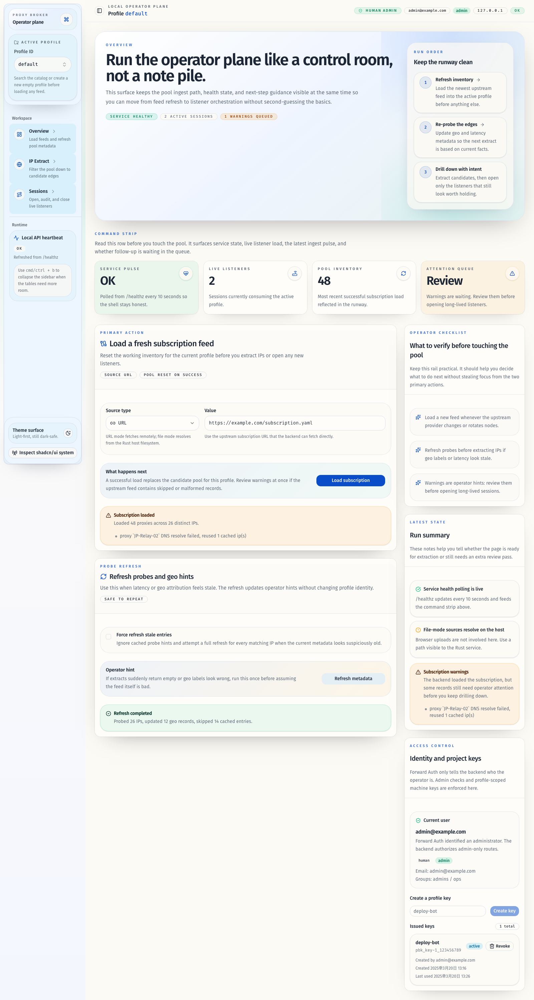
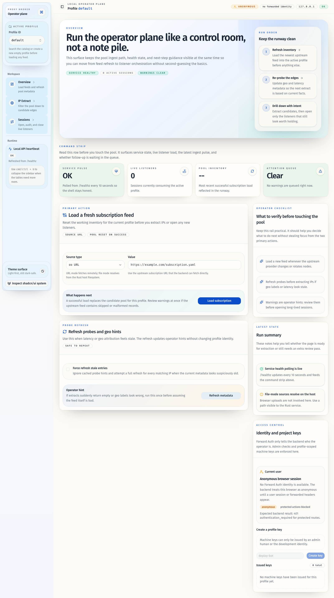

# Forward Auth 身份识别、管理员授权与 Profile API Key

## Goal

在 `proxy-broker` 内部落地完整的鉴权与授权链路：Forward Auth 只负责识别人类用户身份，应用自身负责管理员判定、开发模式身份注入，以及 Profile 级机器 API Key 的发行、校验和访问边界。

## Scope

- 新增运行时鉴权模式 `enforce|development`，默认 `enforce`。
- 从可配置的 Forward Auth 头解析人类身份，并基于用户名白名单/用户组白名单判定管理员身份。
- 在 `development` 模式下强制注入固定开发用户 principal，并始终视为管理员。
- 新增 `GET /api/v1/auth/me` 以暴露当前 principal 上下文。
- 新增 Profile 级 API Key 的存储、一次性签发、撤销、`last_used_at` 更新与后端校验。
- 把 `/`、静态资源、profile 管理接口、profile 业务接口收敛到明确的授权矩阵。
- 在 Web 管理台显示当前身份，并提供管理员可用的 Profile API Key 管理界面。
- 更新 README、部署说明、HTTP/DB 契约文档。

## Non-Goals

- 不实现内建用户名密码登录。
- 不实现外部 JWT/JWKS 机器鉴权。
- 不实现多 profile 共享 API Key。
- 不引入人类用户数据库或更细粒度的人类 profile 权限模型。
- 不在网关侧自动部署 Forward Auth 组件。

## Acceptance Criteria

- `PROXY_BROKER_AUTH_MODE=enforce` 时，无凭证访问 `/`、静态资源或受保护 API 返回 `401 authentication_required`。
- Forward Auth 识别出的人类用户，只有命中 `PROXY_BROKER_AUTH_ADMIN_USERS` 或 `PROXY_BROKER_AUTH_ADMIN_GROUPS` 才能访问管理台与管理接口；非管理员人类除 `/api/v1/auth/me` 外全部返回 `403 admin_required`。
- `PROXY_BROKER_AUTH_MODE=development` 时，即使没有 Forward Auth 头，也会解析为开发用户 principal，且该用户始终为管理员。
- Profile 级 API Key 仅允许访问绑定 profile 的业务接口；跨 profile 访问返回 `403 profile_access_denied`。
- API Key 不能访问 `/`、静态资源、`/api/v1/profiles` 与 `/api/v1/profiles/{profile_id}/api-keys*`。
- API Key 创建响应只返回一次明文 secret，后续列表仅返回 `key_id/name/prefix/profile_id/created_by/created_at/last_used_at/revoked_at`。
- SQLite 与 Memory store 都支持 API Key 的增查撤销与 `last_used_at` 更新。
- Web 管理台展示当前 principal，并允许管理员创建与撤销当前 profile 的机器密钥。

## Verification

- `cargo test --all-features`
- `cargo clippy --all-targets --all-features -- -D warnings`
- `cd web && bun install --frozen-lockfile`
- `cd web && bun run check`
- `cd web && bun run test`
- `cd web && bun run typecheck`
- `cd web && bun run build`

## Outcome

- 后端新增 `AuthConfig`、请求级 principal 解析中间件、开发模式注入逻辑，以及管理员/Profile 访问守卫。
- 路由矩阵固定为：`/healthz` 公开；`/` 与嵌入静态资源仅管理员人类或开发 principal 可访问；`/api/v1/profiles` 与 `/api/v1/profiles/{profile_id}/api-keys*` 仅管理员人类或开发 principal 可访问；`/api/v1/profiles/{profile_id}/subscriptions|refresh|ips|sessions` 允许管理员人类、开发 principal 或匹配 profile 的 API Key 访问。
- API Key secret 采用 `pbk_<key_id>_<random>` 形状，落库仅保存 `salt + sha256(secret)`，校验使用常量时间比较。
- Web 管理台新增身份展示与 Profile API Key 管理卡片，支持一次性显示最新签发的 secret。
- 部署文档明确说明了 Forward Auth 头透传方式、开发模式、管理员白名单配置与机器调用示例。

## Completion Evidence

默认管理员页面中，当前用户状态同时出现在顶部状态条的 compact 视图，以及右侧 `Access control` 卡片中的 detail 视图：

匿名页面中，顶部状态条和 `Access control` 卡片都会明确显示匿名状态，并提示受保护操作会被阻止：

