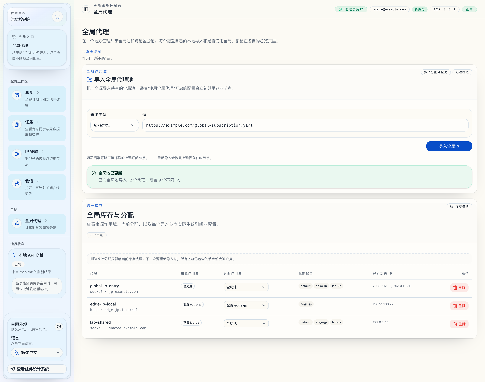
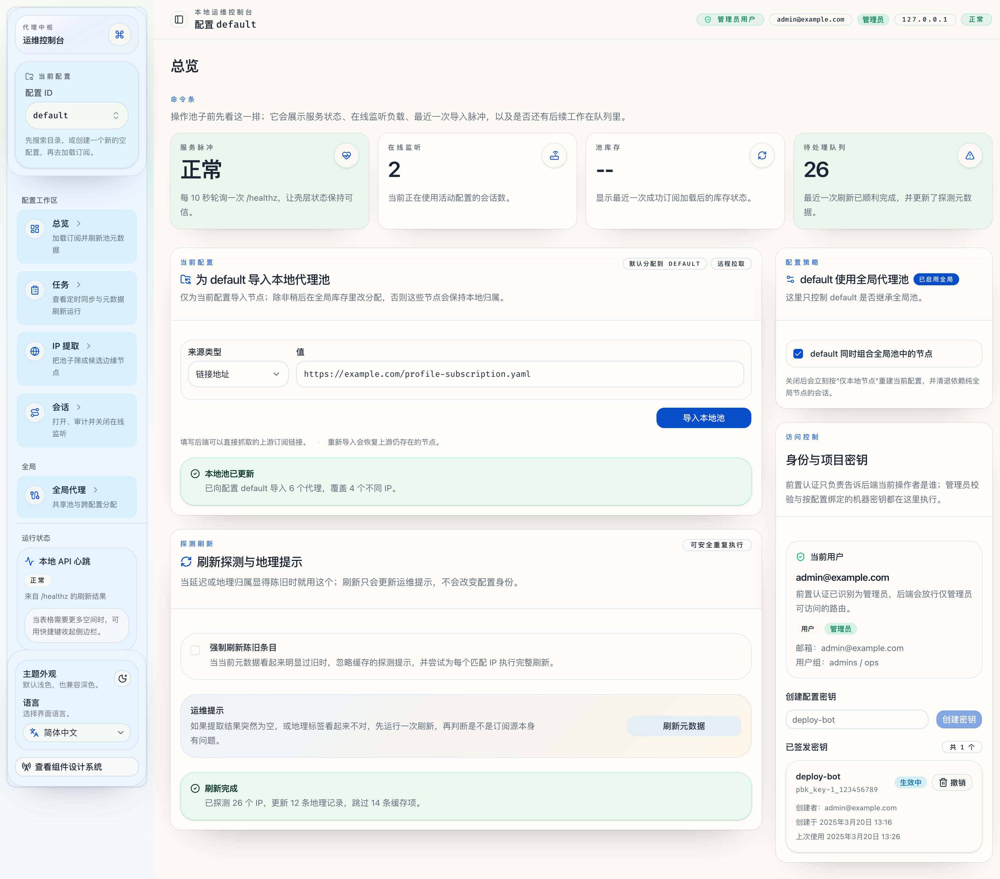
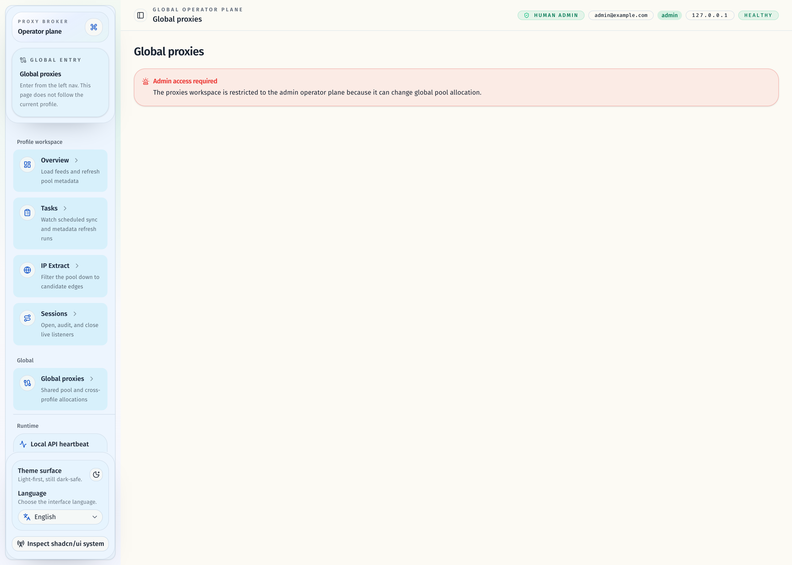

# 全局代理池、Profile 分配与 Proxies 工作区

## Goal

把代理节点管理拆成清晰的两层入口，支持：

- 在独立的全局工作区导入全局代理池。
- 在各自 profile 的总览页导入本地代理池。
- 在全局工作区查看全局与所有 profile 的代理节点库存。
- 在全局工作区调整节点当前分配到 `global` 或某个 `profile`。
- 在全局工作区删除当前库存里的导入节点。
- 在各自 profile 的总览页提供二态开关：`使用全局代理 / 不使用全局代理`。

## Scope

- 新增管理员工作区 `/proxies`，并在 AppShell 里通过独立的 `全局代理` 导航入口暴露出来。
- `/proxies` 必须使用独立的全局壳层，不显示 profile selector，也不承载任何 profile-local 配置入口。
- 当前 profile 的本地导入与 `use_global_proxies` 开关必须保留在该 profile 的 `Overview` 页面内。
- 后端新增 inventory layer：导入节点同时记录 `source_scope` 与 `allocation_scope`。
- 现有 profile 业务接口继续按 profile 工作，但有效池改为：
  - 本地节点
  - 加上全局节点（仅当 `use_global_proxies=true`）
- 在这些事件后重建受影响 profile 的有效快照：
  - 导入全局源
  - 导入 profile 本地源
  - 修改 allocation
  - 删除 inventory 节点
  - 切换 `use_global_proxies`
- existing / new profiles 默认 `use_global_proxies=true`。

## Non-Goals

- 不新增独立 `project` 实体。
- 不支持手动单节点新增/编辑。
- 不支持 profile 级细粒度挑选全局节点。
- 不引入新的全局自动同步任务或 task center 扩展。

## Data Model

### Proxy inventory node

每个导入节点都持有：

- `node_id`
- `proxy_name`
- `proxy_type`
- `server`
- `resolved_ips[]`
- `raw_proxy`
- `source_scope`
- `allocation_scope`
- `created_at`
- `updated_at`

### Profile proxy settings

- `profile_id`
- `use_global_proxies`

## Effective Pool Rules

- `allocation_scope=global` 的节点会进入所有 `use_global_proxies=true` 的 profile。
- `allocation_scope=profile:<id>` 的节点只进入对应 profile。
- 同名代理在同一个 profile 的 effective pool 里只保留一个赢家，优先级为：
  1. 直接分配给当前 profile 的节点优先于 global。
  2. 同级时，来源就是当前 profile 的节点优先。
  3. 再按 `updated_at` 新的优先。
  4. 最后按 `node_id` 稳定收敛。
- 删除或改分配只影响当前 inventory 快照；后续重新导入以源数据为准，上游仍存在的节点会恢复。

## API Contract

### 新增管理员接口

- `POST /api/v1/proxies/global/subscriptions/load`
  - 导入全局源并重建所有已启用 global 的 profile 有效池。
- `GET /api/v1/proxies?scope=all|global|profile&profile_id=...`
  - 返回 inventory 列表：
    - `node_id`
    - `proxy_name`
    - `proxy_type`
    - `server`
    - `resolved_ips`
    - `source_scope`
    - `allocation_scope`
    - `effective_profile_ids`
- `PATCH /api/v1/proxies/{node_id}/allocation`
  - 把节点当前分配到 `global` 或某个 `profile`。
- `DELETE /api/v1/proxies/{node_id}`
  - 删除当前 inventory 快照中的导入节点。
- `GET /api/v1/profiles/{profile_id}/proxy-settings`
- `PATCH /api/v1/profiles/{profile_id}/proxy-settings`
  - 仅暴露 `use_global_proxies`。

### 保留接口的语义变更

- `POST /api/v1/profiles/{profile_id}/subscriptions/load`
  - 语义更新为：导入当前 profile 的本地节点并重建该 profile 的 effective pool。

## UI Contract

### Proxies workspace

`/proxies` 是独立的全局管理面，只承载：

- 全局导入卡片。
- 全局 inventory table：展示所有导入节点、来源作用域、当前分配作用域、生效 profile，并提供改分配与删除动作。
- 管理员访问控制与错误态。

这个页面必须从侧边栏独立的 `全局 > 全局代理` 入口进入；它不得出现当前 profile selector，不得出现 profile-local 导入卡片，也不得出现 `use_global_proxies` 开关。

### Overview workspace

- 保留 health、refresh、access control 等 profile 运营面。
- 新增当前 profile 的本地代理导入卡片。
- 新增当前 profile 的 `use_global_proxies` 策略卡片。
- profile-local 入口不得反向承载全局池导入或跨 profile 分配。

## Acceptance Criteria

- 当某 profile 同时拥有本地节点和全局节点，且 `use_global_proxies=true` 时，`/ips`、`/sessions`、`/refresh`、`suggested-port` 都基于联合池工作。
- 当某 profile 关闭 `use_global_proxies` 时，其 effective pool 立即只保留本地节点，依赖纯全局节点的 session 会按现有 reconcile 规则被清退。
- 管理员导入 global source 后，所有默认启用 global 的 existing / new profiles 都能立即看到这些节点，无需逐 profile 再细配。
- 节点从 `global -> profile`、`profile -> global` 或 `profileA -> profileB` 改分配时，仅受影响的 profiles 会重建快照。
- 删除导入节点后会立刻从当前 inventory 消失；后续若相同 source 重新导入且上游仍包含它，则节点会恢复。
- 非管理员或 API key 访问 `Proxies` 页面与新增管理员接口时，必须被拒绝，不返回 profile-scoped 降级结果。

## Verification

- `cargo test --all-features`
- `cargo clippy --all-targets --all-features -- -D warnings`
- `cd /Users/ivan/.codex/worktrees/12bb/proxy-broker/web && bun run check`
- `cd /Users/ivan/.codex/worktrees/12bb/proxy-broker/web && bun run typecheck`
- `cd /Users/ivan/.codex/worktrees/12bb/proxy-broker/web && bun run test`
- `cd /Users/ivan/.codex/worktrees/12bb/proxy-broker/web && bun run verify:stories`
- `cd /Users/ivan/.codex/worktrees/12bb/proxy-broker/web && bun run build`
- `cd /Users/ivan/.codex/worktrees/12bb/proxy-broker/web && bun run test:e2e`

## Outcome

- 新的管理员工作区 `Proxies` 已接管全局导入、节点 inventory 查看、跨 profile 分配与删除操作。
- `Overview` 已接管当前 profile 的本地导入和 `use_global_proxies` 开关。
- profile 有效池现在由 inventory layer 统一组合，不再直接把订阅源导入结果视为 profile 最终池。
- SQLite 与 memory store 都已持久化 inventory 节点与 `profile_proxy_settings`。
- 现有业务接口保持 profile 视角不变，但快照重建逻辑已改为读取 effective pool。

## Visual Evidence

- `source_type=storybook_canvas`
- `target_program=mock-only`
- `capture_scope=element`
- `sensitive_exclusion=N/A`
- `submission_gate=pending-owner-approval`
- `story_id_or_title=Pages/ProxiesPage/ZhCN`
- `state=全局代理工作区（zh-CN）`
- `evidence_note=展示 /proxies 已切到独立的全局壳层，并通过左侧 `全局 > 全局代理` 导航入口进入，不再显示 profile selector，且只承载全局池导入与跨 profile inventory 分配。`

- `source_type=storybook_canvas`
- `target_program=mock-only`
- `capture_scope=element`
- `sensitive_exclusion=N/A`
- `submission_gate=pending-owner-approval`
- `story_id_or_title=Pages/OverviewPage/ZhCN`
- `state=profile 总览页中的代理设置（zh-CN）`
- `evidence_note=展示当前 profile 的本地导入与 use_global_proxies 开关已经回收到 Overview，不再与全局池配置混放。`

- `source_type=storybook_canvas`
- `target_program=mock-only`
- `capture_scope=element`
- `sensitive_exclusion=N/A`
- `submission_gate=pending-owner-approval`
- `story_id_or_title=Pages/ProxiesPage/AccessDenied`
- `state=admin-only access gate`
- `evidence_note=展示非管理员访问全局代理工作区时的拒绝态，证明这个入口仍是独立的全局管理面，而不是退化回 profile-scoped 页面。`

