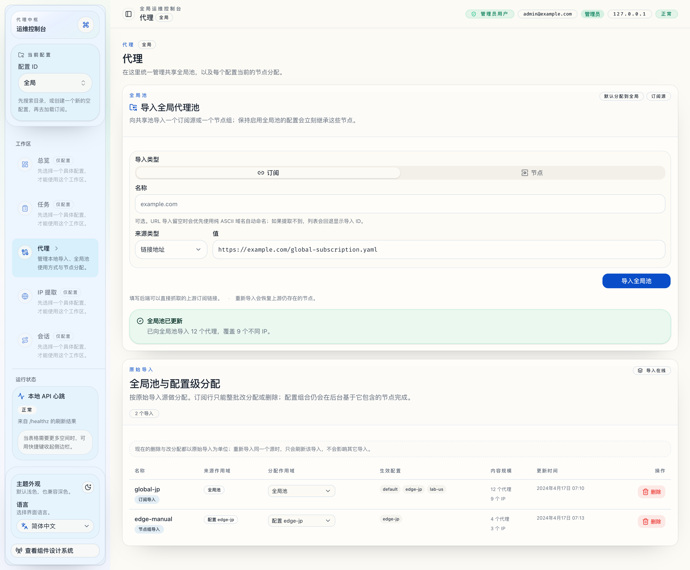
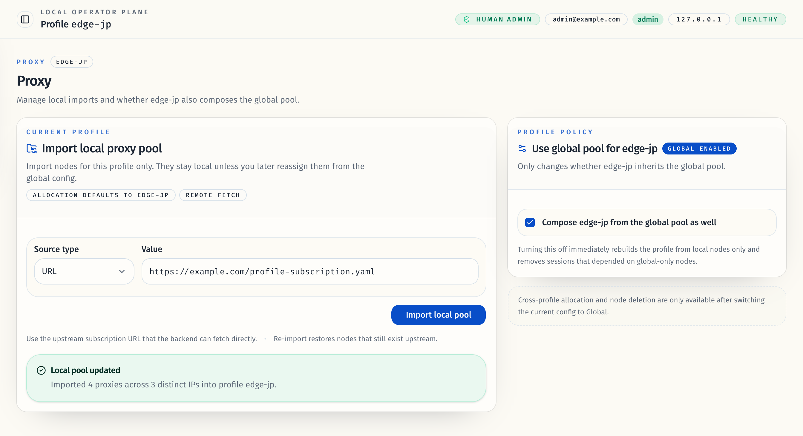
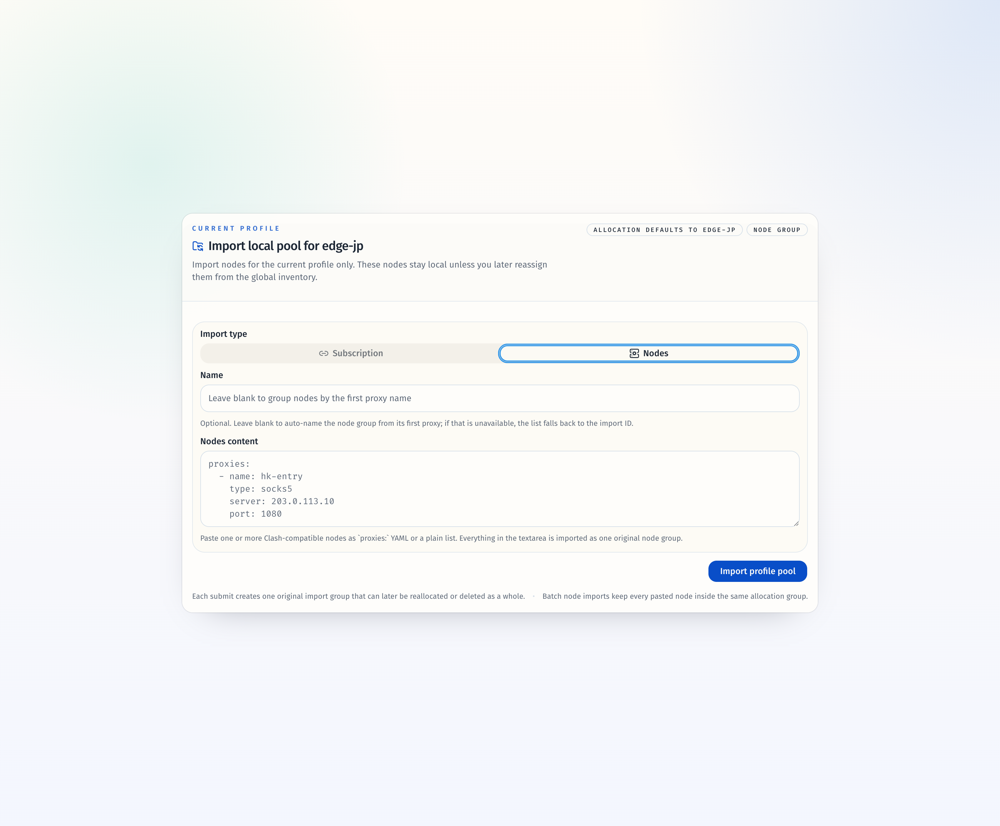

# 代理订阅归属与原始导入级分配（#qvbmc）

## 状态

- Status: 已完成
- Created: 2026-04-17
- Last: 2026-04-19

## 背景 / 问题陈述

- 当前 inventory layer 只按 `source_scope + proxy_name` 建模，导致同一 scope 下的多个订阅会互相覆盖，无法保留“原始导入”边界。
- `/proxies` 全局页当前按节点展示与分配，无法表达“整份订阅属于哪个导入、当前被分配到哪里”。
- profile 自动订阅维护目前只支持“每个 profile 一条 source 配置”，多个本地订阅会互相覆盖。

## 目标 / 非目标

### Goals

- 把“原始导入（import）”升格为一等实体，订阅内节点按 `import + proxy_name` 唯一。
- 同一 `global/profile` scope 下允许多个订阅并存，同源重导入只覆盖对应 import。
- `/proxies` 全局页改成一维 import 列表，订阅只支持整批分配/删除。
- 把 profile 自动订阅维护改成 import 级配置，避免多个本地订阅互相覆盖。

### Non-goals

- 不新增订阅内单节点编辑或分配 UI。
- 不给全局订阅新增自动同步。
- 不重做导航结构或另开新的代理工作区。

## 范围（Scope）

### In scope

- 新增 `proxy_imports` / import-level sync config 数据模型与迁移。
- 保留 node inventory 作为内部明细层，但让其从属于 import。
- 新增 import 级管理员 API，并把 `/proxies` 页面切到 import 级数据源。
- 为订阅与节点组导入补充可选名称输入；节点导入支持一次导入一个包含多个节点的原始组。
- 更新 Storybook、视觉证据与相关 docs/contracts。

### Out of scope

- task center 的新页面或新筛选维度。
- 删除旧 node 级 API。

## 需求（Requirements）

### MUST

- 同一 scope 下的多个订阅能并存，即使它们含有同名代理。
- 同源重导入仅替换对应 import 下节点，不影响其它 import。
- import 级 allocation/delete 会整批作用于订阅导入。
- profile-local 多订阅自动同步彼此独立，不再互相覆盖 source。
- 订阅导入与节点组导入都提供可选名称；列表主列只显示名称，缺省时回退到 import ID。
- 节点组导入允许一次提交一个或多个 Clash-compatible 节点，并作为单个原始导入进行分配/删除。

### SHOULD

- 旧 node 级 API 保持可调用，但语义跟随 import 级规则。
- import 列表清楚展示来源、当前分配、生效 profile、节点数与 IP 数。

### COULD

- 节点组名称生成策略后续可扩展为更丰富的模板或可配置规则。

## 功能与行为规格（Functional/Behavior Spec）

### Core flows

- `POST /api/v1/proxies/global/subscriptions/load`：根据 `source.type + source.value` 归一化结果，在 `global` scope 内 upsert 一个 subscription import；保留既有 allocation，并只替换该 import 下节点。
- `POST /api/v1/profiles/{profile_id}/subscriptions/load`：在当前 profile scope 内按 source upsert import，并为该 import 建立/更新自动维护配置。
- 同一 load 接口也接受 inline node-group 内容：不注册自动同步，并把一次提交的全部节点作为单个原始导入持久化。
- `GET /api/v1/proxy-imports`：返回 import 列表，供 `/proxies` 全局页一维表格展示与操作。
- `PATCH/DELETE /api/v1/proxy-imports/{import_id}`：分别更新整批 allocation、删除整批 import，并重建受影响 profile 的 effective pool。

### Edge cases / errors

- source 不可解析、订阅无有效代理、所有节点 DNS 都失败时，维持现有订阅无效错误。
- load 请求同时提交 `source` 与 `content`，或两者都缺失时，返回 `invalid_request`。
- allocation 指向不存在的 profile 时拒绝。
- 删除 import 时需一并移除其 sync config；全局 import 不允许注册自动同步。

## 接口契约（Interfaces & Contracts）

### 接口清单（Inventory）

| 接口（Name） | 类型（Kind） | 范围（Scope） | 变更（Change） | 契约文档（Contract Doc） | 负责人（Owner） | 使用方（Consumers） | 备注（Notes） |
| --- | --- | --- | --- | --- | --- | --- | --- |
| Proxy import admin APIs | HTTP | external | New | ./contracts/http-apis.md | proxy-broker | web admin UI | `GET/PATCH/DELETE /api/v1/proxy-imports*` |
| Import persistence | DB | internal | New | ./contracts/db.md | proxy-broker | Rust store/service | `proxy_imports` 与 import sync configs |
| Broker store/service import facade | Rust API | internal | Modify | ./contracts/rust-api.md | proxy-broker | api/service/tests | import-level upsert / allocation / sync |

### 契约文档（按 Kind 拆分）

- [contracts/README.md](./contracts/README.md)
- [contracts/http-apis.md](./contracts/http-apis.md)
- [contracts/db.md](./contracts/db.md)
- [contracts/rust-api.md](./contracts/rust-api.md)

## 验收标准（Acceptance Criteria）

- Given 同一 scope 下导入两个不同订阅且都含 `proxy_name=jp-a`
  When 导入完成
  Then 两个 import 都保留，effective pool 只在 profile 组合阶段做去重。
- Given 某订阅已被分配到 `profile:edge-jp`
  When 对同一 source 再次重导入
  Then allocation 保持 `profile:edge-jp`，且只替换该 import 下节点。
- Given `/proxies` 处于全局上下文
  When 打开 import 列表
  Then 页面只展示原始导入行，不展示订阅内部节点的分配控件。
- Given 某 profile 有两个本地订阅 import
  When 自动同步其中一个 source
  Then 只更新对应 import，不覆盖另一个 import 的 source 配置。
- Given operator 留空节点组名称并粘贴两个节点
  When 导入完成
  Then 列表主列显示自动生成的组名（例如首个节点名 + 计数），且该组只能整批分配/删除。

## 非功能性验收 / 质量门槛（Quality Gates）

### Testing

- Unit tests: Rust service/store tests 覆盖多 import 并存、整批 allocation/delete、import-level sync config。
- Integration tests: API tests 覆盖 `proxy-imports` 列表、整批分配、整批删除。
- E2E tests (if applicable): `/proxies` 全局页 smoke 覆盖 import 表格文案与动作。

### UI / Storybook (if applicable)

- Stories to add/update: `web/src/pages/ProxiesPage.stories.tsx`
- Stories to add/update: `web/src/features/proxies/components/ProxyLoadCard.stories.tsx`
- Docs pages / state galleries to add/update: 复用该 stories 的 autodocs/canvas 入口
- `play` / interaction coverage to add/update: global/profile/access denied 三个关键态，以及节点组导入态

### Quality checks

- Lint / typecheck / formatting: `cargo clippy --all-targets --all-features -- -D warnings`、`bun run check`、`bun run typecheck`

## 文档更新（Docs to Update）

- `docs/contracts/db.md`: 记录 import-level schema 与 sync config 迁移。
- `docs/contracts/http-apis.md`: 记录 `proxy-imports` API 与 load 语义更新。
- `docs/contracts/rust-api.md`: 记录 store/service import facade。
- `docs/specs/README.md`: 增加本规格索引。

## 计划资产（Plan assets）

- Directory: `docs/specs/qvbmc-proxy-import-allocation/assets/`
- In-plan references: ``
- Visual evidence source: maintain `## Visual Evidence` in this spec when owner-facing or PR-facing screenshots are needed.

## Visual Evidence

- source_type: storybook_canvas
  story_id_or_title: `Pages/ProxiesPage/Zh CN`
  state: 全局导入列表
  evidence_note: 验证 `/proxies` 全局页已经切到“原始导入”一维表，列表主列只显示名称（无名称时回退 ID），订阅仍以整批导入展示并提供 import 级分配/删除入口。
  image:
  

- source_type: storybook_canvas
  story_id_or_title: `Pages/ProxiesPage/Profile Config`
  state: profile-local import policy
  evidence_note: 验证 profile 侧保留“导入本地代理池 + 是否组合全局池”的入口，不再在该视图里暴露跨配置的节点级分配。
  image:
  

- source_type: storybook_canvas
  story_id_or_title: `Features/Proxies/ProxyLoadCard/Node Group Mode`
  state: 节点组批量导入
  evidence_note: 验证导入卡片新增“名称”输入与“节点组”模式，可一次粘贴多个节点并将其作为一个原始导入组提交。
  image:
  

## 资产晋升（Asset promotion）

None

## 实现里程碑（Milestones / Delivery checklist）

- [x] M1: 落地 import-level store/schema/service，并让 load/rebuild/auto-sync 使用 import 级语义
- [x] M2: 新增 import 级 API 与 `/proxies` import 列表 UI，替换原全局节点分配表
- [x] M3: 补齐 Storybook、视觉证据、验证与 PR 收敛所需测试

## 方案概述（Approach, high-level）

- 在 inventory node 之外新增 import 头实体，节点改为从属于 import，并把 allocation 提升到 import 层统一管理。
- profile effective pool 继续从 node 明细层组合，但同名去重只发生在 profile 组合阶段。
- 自动订阅维护改为“按 profile 聚合调度、按 import 独立 source 执行”的混合模式，避免改动现有 task API 形状。

## 风险 / 开放问题 / 假设（Risks, Open Questions, Assumptions）

- 风险：SQLite 迁移需要兼容现有安装并平滑补齐历史 inventory 数据。
- 需要决策的问题：若未来新增独立节点导入入口，是否直接复用 `proxy_imports` 的 `single_node` kind。
- 假设（需主人确认）：source identity 采用 `source.type + trimmed source.value` 作为 import 唯一键。

## 变更记录（Change log）

- 2026-04-17: 初版规格，冻结 import-level allocation 与 sync 方向。
- 2026-04-19: 修正 SQLite 旧库升级顺序，保证 `proxy_inventory_nodes` 会先补齐 `import_id/source_type/source_value` 再创建 import-level 索引，避免旧安装在启动阶段因 `no such column: import_id` 崩溃。

## 参考（References）

- `docs/specs/jrhgg-global-proxy-pool-and-allocation/SPEC.md`
- `docs/specs/y5yx8-task-module-and-auto-subscription-maintenance/SPEC.md`
