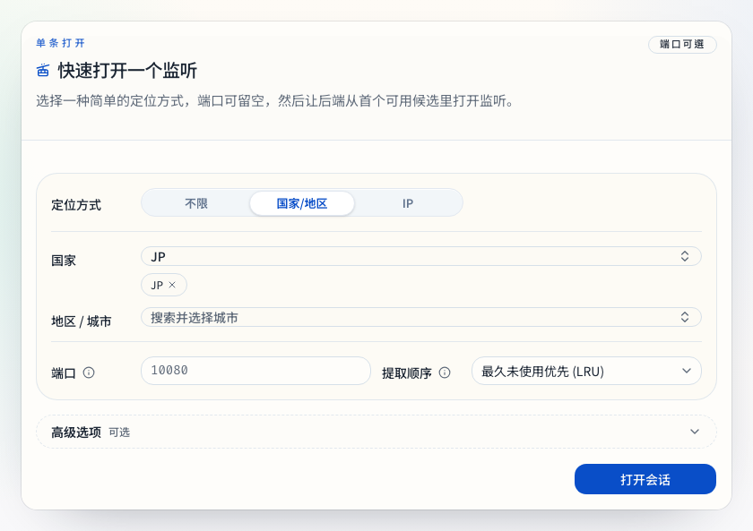
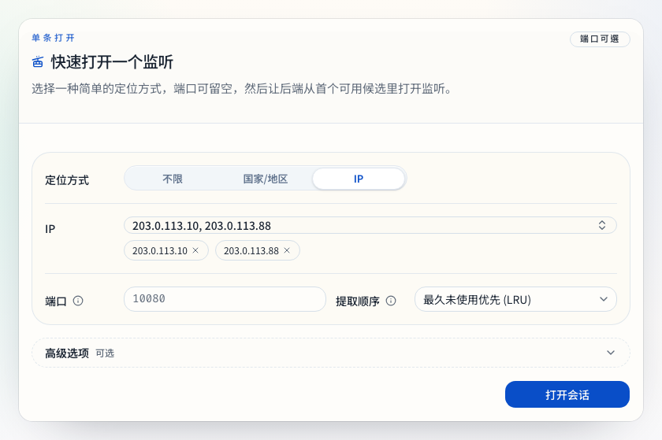
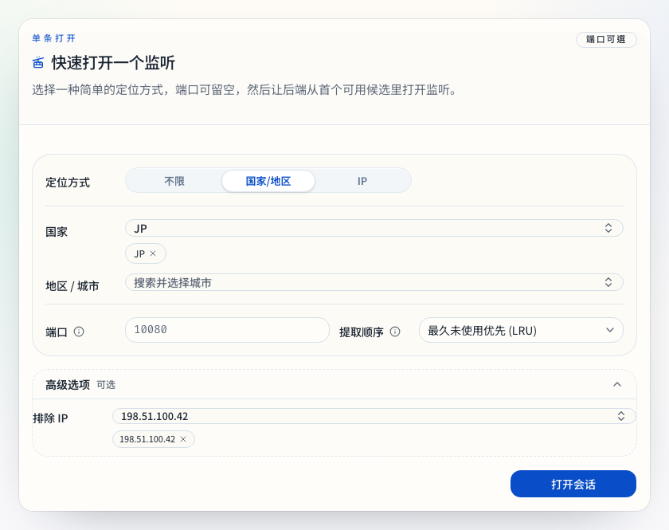
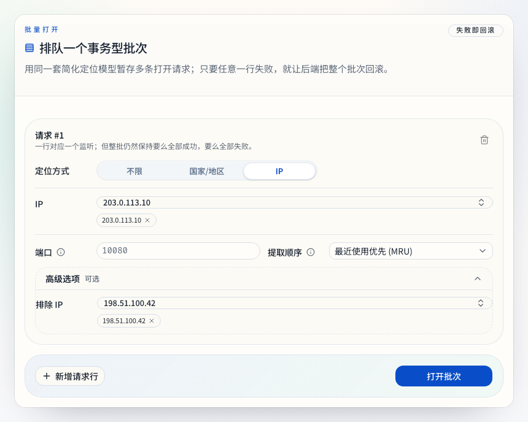
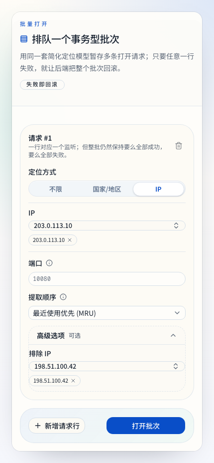

# Admin UI Refresh

## Goal

Refactor the Bun + React operator console into a denser control-room interface
that keeps the three workflows (load/refresh, IP extraction, session
orchestration) faster to scan and safer to operate, while allowing the sessions
entrypoint to tighten its request model around the simplified create flow.

## Scope

- Rebuild the shared web admin visual system around a light-first shadcn/ui
  dashboard language with stronger hierarchy, compact data surfaces, and clearer
  keyboard/mouse feedback.
- Rework the main shell plus `/`, `/ips`, and `/sessions` into a control-room
  layout with route heroes, summary rails, denser tables, and explicit state
  panels.
- Update stories, tests, and smoke coverage for the refreshed UI states.

## Non-Goals

- No redesign of the `/ips/extract` workspace around the new session flow model.
- No changes to live session listing/closing semantics or client-side
  persistence beyond existing local preferences.

## Acceptance Criteria

- The shell presents profile, host, health, and workspace context with stronger
  navigation cues and accessible focus/alert states.
- Overview reads as an operator runway with KPI summary, action cards, and clear
  warning/next-step surfaces.
- IP Extract reads as a filter-first workspace with request summary, loading,
  empty, error, and results states that remain usable on mobile.
- Sessions reads as a live orchestration surface with a three-mode create flow
  (`不限 / 国家地区 / IP`), searchable multi-select targeting, a suggested-port
  hint, visible sort order, and advanced exclusions tucked behind a disclosure.
- The sessions API exposes a flattened open/open-batch contract plus read-only
  helper endpoints for suggested ports and searchable session option lookups.
- Storybook and automated checks cover refreshed component/page states, and the
  smoke flow remains green.

## Verification

- `bun run check`
- `bun run typecheck`
- `bun run test`
- `bun run verify:stories`
- `bun run build`
- `bun run build-storybook`
- `bun run test:e2e`
- `cargo test --lib`

## Outcome

- The control-room shell, overview runway, IP extract workspace, and sessions
  workspace are implemented on the current PR branch, and the sessions create
  flow now uses a mode-driven request contract instead of the old nested
  selector payload.
- The sidebar shell now uses a compact brand strip so the active profile input
  and workspace navigation stay visible without the oversized intro card.
- Shared field controls now use an explicit size system so large trigger,
  content, and item surfaces stay visually consistent across the real app and
  Storybook.
- Route-level UI summaries now keep successful results scoped to the profile
  that produced them, preventing stale cross-profile state from leaking into
  the operator panels.
- The Sessions workspace now has dedicated helper APIs for suggested ports and
  searchable country/city/IP option lists, while keeping batch-open rollback
  behavior intact.

## Visual Evidence

- `source_type=storybook_canvas`
- `target_program=mock-only`
- `capture_scope=element`
- `sensitive_exclusion=N/A`
- `submission_gate=pending-owner-approval`
- `story_id_or_title=Features/Sessions/OpenSessionForm/Geo Mode`
- `state=single-open geo mode`
- `evidence_note=Shows the simplified country-region path with a compact segmented switch, inline field rows, searchable multi-select chips, visible port plus sort controls, and the advanced disclosure collapsed by default.`

PR: include

- `source_type=storybook_canvas`
- `target_program=mock-only`
- `capture_scope=element`
- `sensitive_exclusion=N/A`
- `submission_gate=pending-owner-approval`
- `story_id_or_title=Features/Sessions/OpenSessionForm/Ip Mode`
- `state=single-open ip mode`
- `evidence_note=Shows the direct IP targeting path with the same compact segmented switch, inline field rows, and multi-select IP chips.`

- `source_type=storybook_canvas`
- `target_program=mock-only`
- `capture_scope=element`
- `sensitive_exclusion=N/A`
- `submission_gate=pending-owner-approval`
- `story_id_or_title=Features/Sessions/OpenSessionForm/Advanced Open`
- `state=single-open advanced expanded`
- `evidence_note=Shows the Advanced disclosure reusing the same inline label column as the primary form so the exclude-IP field stays compact and aligned with the main controls.`

PR: include

- `source_type=storybook_canvas`
- `target_program=mock-only`
- `capture_scope=element`
- `sensitive_exclusion=N/A`
- `submission_gate=pending-owner-approval`
- `story_id_or_title=Features/Sessions/OpenBatchForm/Advanced Open`
- `state=batch advanced expanded`
- `evidence_note=Shows one transactional batch row using the shared compact three-mode model, with the Advanced exclude-IP field pulled back onto the same label axis as the primary row controls.`

PR: include

- `source_type=storybook_canvas`
- `target_program=mock-only`
- `capture_scope=element`
- `sensitive_exclusion=N/A`
- `submission_gate=pending-owner-approval`
- `story_id_or_title=Features/Sessions/OpenBatchForm/Advanced Open`
- `state=mobile layout`
- `evidence_note=Shows the same batch-open flow at a narrow mobile viewport, confirming the controls stack vertically without hiding the primary submit path.`

## Visual Evidence (PR)

- `source_type=storybook_canvas`
- `target_program=mock-only`
- `capture_scope=browser-viewport`
- `story_id_or_title=Components/AppShell/Default`
- `state=compact sidebar brand strip`
- `evidence_note=Shows the compressed sidebar header after removing the large intro copy and duplicate host/health pills while keeping profile access and navigation context visible.`

