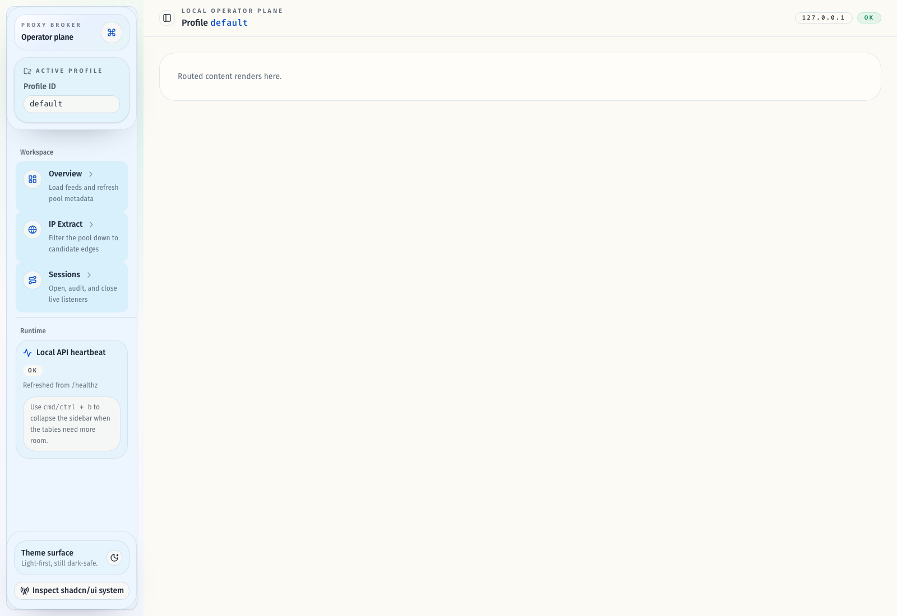

# Admin UI Refresh

## Goal

Refactor the Bun + React operator console into a denser control-room interface that
keeps the existing API contracts intact while making the three workflows
(load/refresh, IP extraction, session orchestration) faster to scan and safer to
operate.

## Scope

- Rebuild the shared web admin visual system around a light-first shadcn/ui
  dashboard language with stronger hierarchy, compact data surfaces, and clearer
  keyboard/mouse feedback.
- Rework the main shell plus `/`, `/ips`, and `/sessions` into a control-room
  layout with route heroes, summary rails, denser tables, and explicit state
  panels.
- Update stories, tests, and smoke coverage for the refreshed UI states.

## Non-Goals

- No changes to Rust routes, JSON payloads, or operator workflow semantics.
- No new backend endpoints or client-side persistence beyond existing local
  preferences.

## Acceptance Criteria

- The shell presents profile, host, health, and workspace context with stronger
  navigation cues and accessible focus/alert states.
- Overview reads as an operator runway with KPI summary, action cards, and clear
  warning/next-step surfaces.
- IP Extract reads as a filter-first workspace with request summary, loading,
  empty, error, and results states that remain usable on mobile.
- Sessions reads as a live orchestration surface with denser open controls,
  live-listener summary, and improved close feedback.
- Storybook and automated checks cover refreshed component/page states, and the
  smoke flow remains green.

## Verification

- `bun run check`
- `bun run typecheck`
- `bun run test`
- `bun run verify:stories`
- `bun run build`
- `bun run build-storybook`
- `bun run test:e2e`

## Outcome

- The control-room shell, overview runway, IP extract workspace, and sessions
  workspace are implemented on the current PR branch without changing backend
  contracts.
- The sidebar shell now uses a compact brand strip so the active profile input
  and workspace navigation stay visible without the oversized intro card.
- Shared field controls now use an explicit size system so large trigger,
  content, and item surfaces stay visually consistent across the real app and
  Storybook.
- Route-level UI summaries now keep successful results scoped to the profile
  that produced them, preventing stale cross-profile state from leaking into
  the operator panels.

## Visual Evidence (PR)

- `source_type=storybook_canvas`
- `target_program=mock-only`
- `capture_scope=browser-viewport`
- `story_id_or_title=Components/AppShell/Default`
- `state=compact sidebar brand strip`
- `evidence_note=Shows the compressed sidebar header after removing the large intro copy and duplicate host/health pills while keeping profile access and navigation context visible.`

