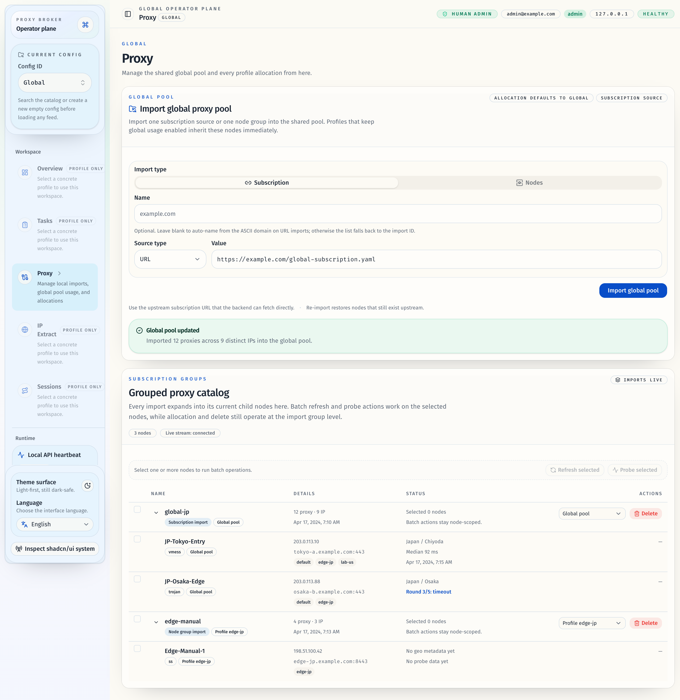
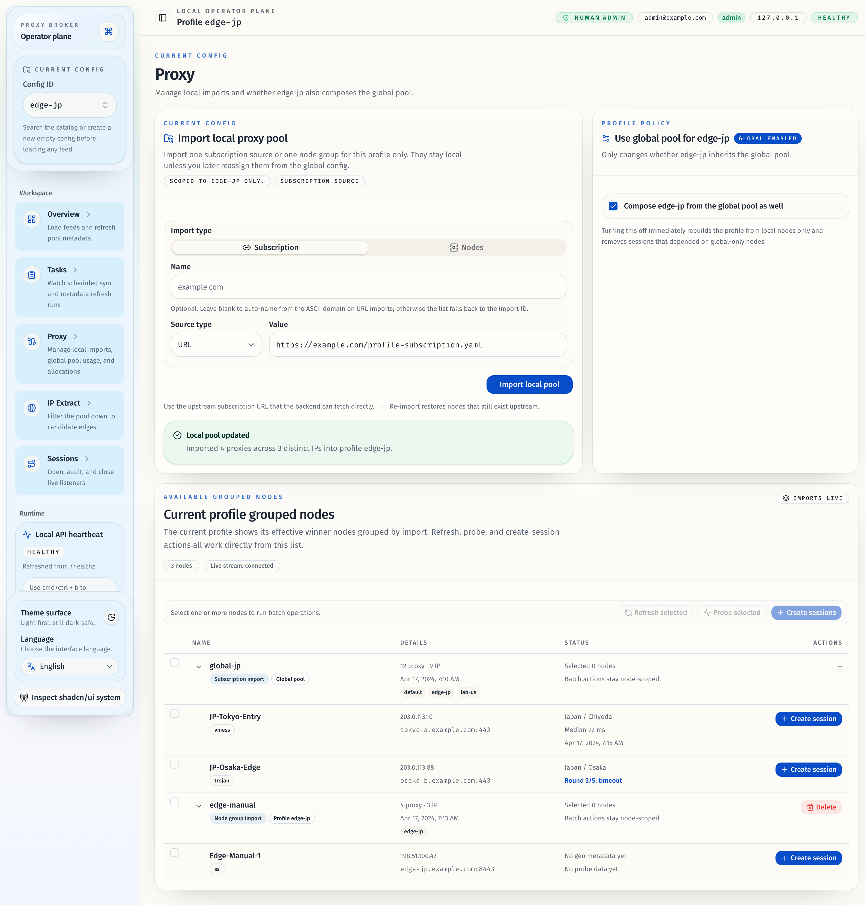
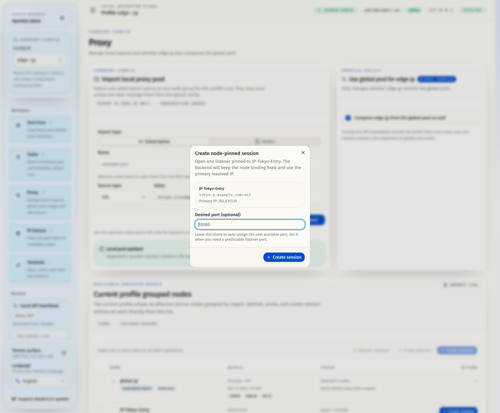
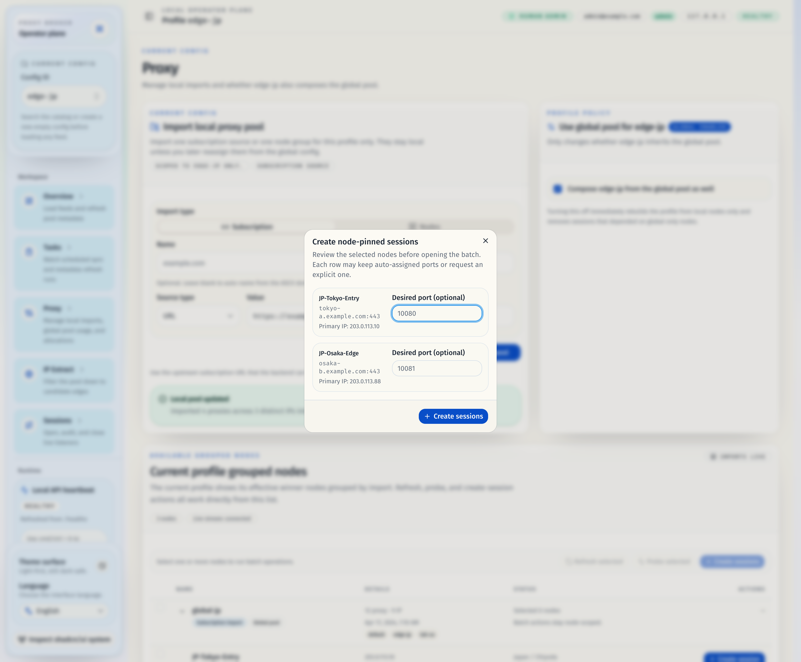
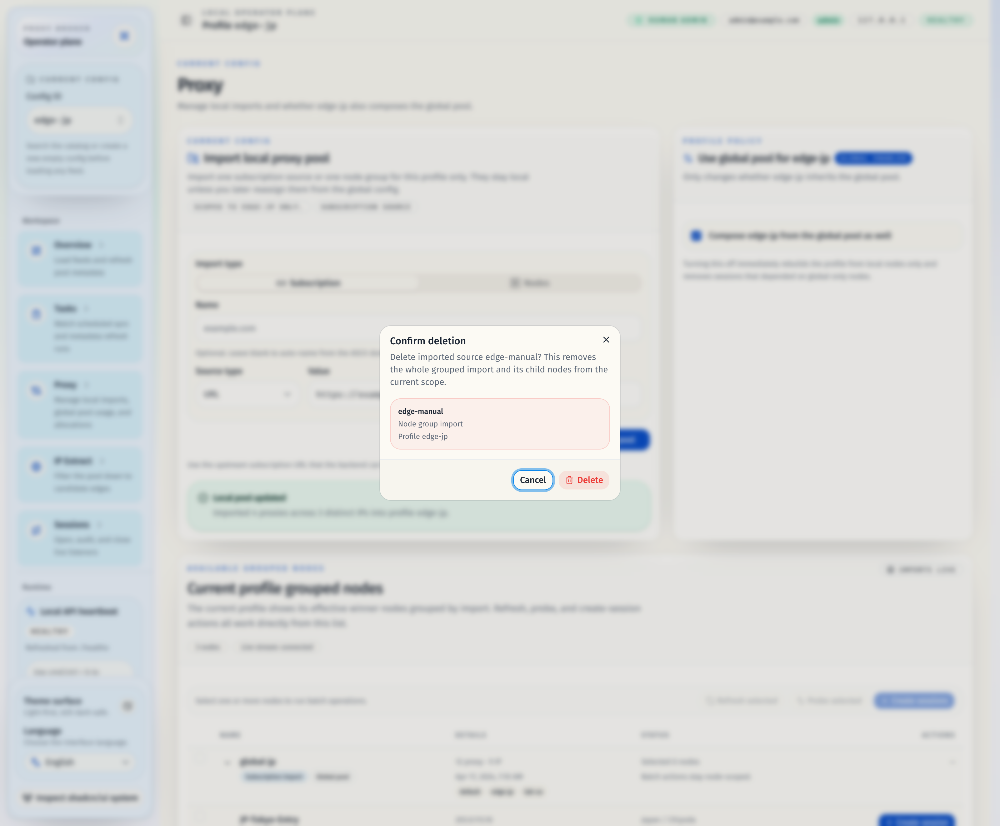

# 代理页订阅分组节点、共享 Runtime 与实时运营流（#s5fwx）

## 状态

- Status: 已实现（本地已验证）
- Created: 2026-04-21
- Last: 2026-04-21

## 背景 / 问题陈述

- `/proxies` 当前只覆盖原始导入级分配，缺少“每个导入下有哪些可用节点”的运营视图。
- 现有元信息刷新、测速与会话打开都强绑定 profile runtime，无法在同一代理工作区里统一运营全局与 profile 节点。
- 会话持久化没有记录 `node_id`，导致后续很难稳定追踪“会话到底绑定了哪个导入节点”。

## 目标 / 非目标

### Goals

- 在 `/proxies` 提供按导入（subscription / node group）分组的节点目录视图。
- 统一运行时为单一共享 runtime，使 Global/Profile 节点运营与测速都基于同一个 controller。
- 为节点级刷新元信息、五次广度优先测速、Profile 级节点定向建会话提供稳定 API 与实时推送。
- 为本次 UI 改动补齐 Storybook 与视觉证据，并推进到 PR merge-ready。

### Non-goals

- Global 视图创建会话。
- 节点建会话前的 IP 选择弹窗。
- 重做 `/sessions` 的整体交互模型。

## 范围（Scope）

### In scope

- `docs/specs/s5fwx-proxy-node-groups-live-ops/**` 与 `docs/specs/README.md`
- 共享 runtime 改造、节点/IP 元信息持久化、`sessions.node_id` 持久化与 best-effort backfill
- `GET /api/v1/proxy-catalog`
- `POST /api/v1/proxy-ops/refresh`
- `POST /api/v1/proxy-ops/probe`
- `POST /api/v1/profiles/{profile_id}/sessions/open-by-node`
- `POST /api/v1/profiles/{profile_id}/sessions/open-batch-by-node`
- `/proxies` 的 grouped node UI、批量操作、Profile-only 会话创建与实时推送
- Storybook、视觉证据、PR 收敛所需验证

### Out of scope

- `/tasks` 独立新页面或新导航入口
- API key / 鉴权模型重做
- 对现有 `/ips`、`/sessions` 路由的视觉重设计

## 需求（Requirements）

### MUST

- Global `/proxies` 按 import 分组展示全部节点，并支持批量 refresh / probe。
- Profile `/proxies` 只展示当前 profile effective pool 中可用的节点，并支持节点级与批量创建会话。
- 节点测速每个节点执行 5 次，采用 breadth-first 顺序，最终返回成功样本的中位数。
- 运行中的测速/刷新结果必须通过实时推送增量显示。
- `SessionRecord` / open 响应必须包含 `node_id`，并对旧数据做 best-effort backfill。
- runtime 内部代理别名必须与 `node_id` / `node_id+ip` 绑定，避免跨 import / 跨 profile 同名节点冲突。

### SHOULD

- 节点元信息真相源提升到 inventory-node/IP 层，并尽量复用历史 profile 级 `ip_records` / `probe_records` 做初次回填。
- Global 视图继续保留 import 级分配/删除操作，不让 grouped node UI 挡住现有运营动作。

### COULD

- 如果一个节点含多个 resolved IP，可在 UI 中同时展示 IP 列表与主 IP 元信息摘要。

## 功能与行为规格（Functional/Behavior Spec）

### Core flows

- Global 视图加载 `proxy-catalog(view=global)`，显示 import 分组与节点明细；允许选择节点并触发 refresh / probe，但不显示 create-session 动作。
- Profile 视图加载 `proxy-catalog(view=profile, profile_id=...)`，显示当前 effective pool 的 grouped nodes；允许对单节点或选中节点批量创建会话。
- `proxy-ops/probe` 为每个目标节点固定选择主 IP（`resolved_ips[0]`）做 5 轮 breadth-first delay probe；每轮样本通过流式事件推送，最终汇总为节点中位延迟。
- `proxy-ops/refresh` 刷新目标节点 IP 的 geo / metadata，并把结果写回节点级元信息存储。
- `sessions/open-by-node` 与 `sessions/open-batch-by-node` 直接按指定 `node_id` 打开会话，并保持 profile 级会话归属不变。

### Edge cases / errors

- 请求节点不在当前视图允许范围内时，返回 `invalid_request`。
- Profile 视图下若节点当前不属于 effective pool，不允许创建会话。
- 节点主 IP 缺失时，probe 与 open-by-node 返回 `proxy_inventory_node_not_found` 或 `subscription_invalid` 语义化错误。
- 五次测速全部失败时，节点最终 `median_latency_ms=null` 且状态显示失败。

## 接口契约（Interfaces & Contracts）

### 接口清单（Inventory）

| 接口（Name） | 类型（Kind） | 范围（Scope） | 变更（Change） | 契约文档（Contract Doc） | 负责人（Owner） | 使用方（Consumers） | 备注（Notes） |
| --- | --- | --- | --- | --- | --- | --- | --- |
| Proxy catalog APIs | HTTP | external | New | ./contracts/http-apis.md | proxy-broker | web `/proxies` | grouped import -> node directory |
| Shared runtime + node metadata persistence | DB | internal | New | ./contracts/db.md | proxy-broker | store/service/runtime | session `node_id` + node/IP metadata |
| Broker service/runtime facade | Rust API | internal | Modify | ./contracts/rust-api.md | proxy-broker | api/service/tests | shared runtime + operator proxy ops |

### 契约文档（按 Kind 拆分）

- [contracts/README.md](./contracts/README.md)
- [contracts/http-apis.md](./contracts/http-apis.md)
- [contracts/db.md](./contracts/db.md)
- [contracts/rust-api.md](./contracts/rust-api.md)

## 验收标准（Acceptance Criteria）

- Given Global `/proxies`
  When 打开 grouped node 目录
  Then 页面按 import 分组展示全部节点，支持展开/折叠、节点选择、批量 refresh/probe，且不显示 create-session 动作。
- Given Profile `/proxies`
  When 选择多个节点并执行批量创建会话
  Then 每个所选节点各创建 1 条会话，响应与后续 session 列表都包含 `node_id`。
- Given 一次 probe 任务
  When breadth-first 5 轮执行完成
  Then 每个节点收到 5 个样本或失败占位，并以成功样本中位数作为最终延迟。
- Given runtime 中存在跨 import 同名节点
  When 应用共享 runtime 配置并创建会话
  Then 会话监听仍能稳定绑定目标节点，不因 `proxy_name` 重名而串线。

## 实现前置条件（Definition of Ready / Preconditions）

- 共享 runtime + node-pinned session 方向已冻结
- Global 不开放 create-session 的边界已冻结
- Profile 默认使用 `resolved_ips[0]` 的约束已冻结
- Storybook 与视觉证据要作为 UI gate 的要求已冻结

## 非功能性验收 / 质量门槛（Quality Gates）

### Testing

- Unit tests: Rust service/store/runtime tests 覆盖 shared runtime config、node metadata backfill、node-pinned open、5 轮 median probe
- Integration tests: HTTP/API tests 覆盖 `proxy-catalog` / `proxy-ops/*` / `open-by-node*`
- E2E tests (if applicable): browser smoke 覆盖 grouped list + live probe + profile batch create-session

### UI / Storybook (if applicable)

- Stories to add/update: `web/src/pages/ProxiesPage.stories.tsx`
- Stories to add/update: grouped node table / batch action related component stories
- `play` / interaction coverage to add/update: Global batch probe、Profile batch create-session、empty / access-denied / loading states

### Quality checks

- `cargo test`
- `bun run check`
- `bun run typecheck`
- `bun run test`
- `bun run verify:stories`
- `bun run test-storybook`
- `bun run build`

## 文档更新（Docs to Update）

- `docs/contracts/http-apis.md`: 记录 proxy catalog / proxy ops / node-pinned session API
- `docs/contracts/db.md`: 记录 `sessions.node_id` 与 node/IP metadata 持久化
- `docs/contracts/rust-api.md`: 记录 shared runtime 与新增 service facade
- `docs/specs/README.md`: 增加本规格索引并随进度更新状态

## 计划资产（Plan assets）

- Directory: `docs/specs/s5fwx-proxy-node-groups-live-ops/assets/`
- In-plan references: ``
- Visual evidence source: maintain `## Visual Evidence` in this spec when owner-facing or PR-facing screenshots are needed.

## Visual Evidence

- `source_type=storybook_canvas`
- `target_program=mock-only`
- `capture_scope=browser-viewport`
- `requested_viewport=1600x1400`
- `viewport_strategy=devtools-emulate`
- `sensitive_exclusion=N/A`
- `submission_gate=approved`
- `story_id_or_title=Pages/ProxiesPage/GlobalConfig`
- `state=global grouped node operations`
- `evidence_note=Shows the Global proxy workspace with import-group rows, child node rows, live stream status, subscription-level allocation controls, and node-level latency/probe state in one stable review surface.`

PR: include

- `source_type=storybook_canvas`
- `target_program=mock-only`
- `capture_scope=browser-viewport`
- `requested_viewport=1600x1400`
- `viewport_strategy=devtools-emulate`
- `sensitive_exclusion=N/A`
- `submission_gate=approved`
- `story_id_or_title=Pages/ProxiesPage/ProfileCatalog`
- `state=profile grouped node catalog`
- `evidence_note=Shows the profile-scoped grouped node list with inherited global nodes, profile-local imports, create-session actions, and the local-import delete affordance visible together in one baseline review surface.`

PR: include

- `source_type=storybook_canvas`
- `target_program=mock-only`
- `capture_scope=browser-viewport`
- `requested_viewport=1600x1400`
- `viewport_strategy=devtools-emulate`
- `sensitive_exclusion=N/A`
- `submission_gate=approved`
- `story_id_or_title=Pages/ProxiesPage/ProfileCreateSessionDialog`
- `state=single node-pinned session form`
- `evidence_note=Shows the single-node create-session dialog with the fixed node binding, primary IP summary, and the optional desired-port field that the operator can set before opening the listener.`

PR: include

- `source_type=storybook_canvas`
- `target_program=mock-only`
- `capture_scope=browser-viewport`
- `requested_viewport=1600x1400`
- `viewport_strategy=devtools-emulate`
- `sensitive_exclusion=N/A`
- `submission_gate=approved`
- `story_id_or_title=Pages/ProxiesPage/ProfileBatchCreateDialog`
- `state=batch node-pinned session form`
- `evidence_note=Shows the batch create-session dialog with one row per selected node and per-node desired-port inputs, proving that batch creation now opens a form instead of executing immediately.`

PR: include

- `source_type=storybook_canvas`
- `target_program=mock-only`
- `capture_scope=browser-viewport`
- `requested_viewport=1600x1400`
- `viewport_strategy=devtools-emulate`
- `sensitive_exclusion=N/A`
- `submission_gate=approved`
- `story_id_or_title=Pages/ProxiesPage/ProfileDeleteConfirmDialog`
- `state=profile import delete confirmation`
- `evidence_note=Shows the destructive confirmation step before removing a profile-local import, including the import label, kind, and scope summary needed for the operator to verify the target.`

PR: include

## 资产晋升（Asset promotion）

None

## 实现里程碑（Milestones / Delivery checklist）

- [x] M1: 落地 shared runtime、`sessions.node_id` 与 node/IP metadata persistence
- [x] M2: 落地 proxy catalog / proxy ops / node-pinned session API 与测试
- [x] M3: 完成 `/proxies` grouped node UI、批量操作与实时推送
- [x] M4: 补齐 Storybook、视觉证据与本地验证；PR merge-ready 收敛等待截图提交授权后继续

## 方案概述（Approach, high-level）

- 以单一共享 runtime 承载所有 inventory 节点与跨 profile listeners，彻底去掉按 profile 分 controller 的限制。
- 保留 profile effective pool 作为业务归属与筛选语义，但 runtime 内部代理命名统一切换到 node-based alias。
- 节点目录与实时运营流都建立在 inventory-node/IP 真相源之上，旧 profile 级元信息仅用于初次回填与兼容旧功能。

## 风险 / 开放问题 / 假设（Risks, Open Questions, Assumptions）

- 风险：shared runtime 改造会影响现有 session reconcile 与回滚逻辑，需要额外测试覆盖。
- 风险：旧 sessions 无 `node_id` 时只能做 best-effort backfill，极端历史数据可能需要首次操作后才能稳定收敛。
- 假设（需主人确认）：Profile 级节点定向建会话固定使用主 IP `resolved_ips[0]`，不做交互式选择。

## 变更记录（Change log）

- 2026-04-21: 初版规格，冻结 grouped node UI、shared runtime、node-pinned session 与实时 proxy ops 范围。
- 2026-04-21: 完成 shared runtime、grouped proxy catalog、node-pinned session API、Storybook 覆盖、本地全量验证与 owner-facing 视觉证据落盘。

## 参考（References）

- `docs/specs/jrhgg-global-proxy-pool-and-allocation/SPEC.md`
- `docs/specs/qvbmc-proxy-import-allocation/SPEC.md`
- `docs/specs/y5yx8-task-module-and-auto-subscription-maintenance/SPEC.md`
