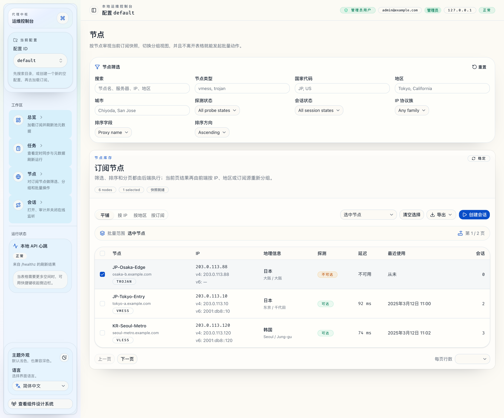
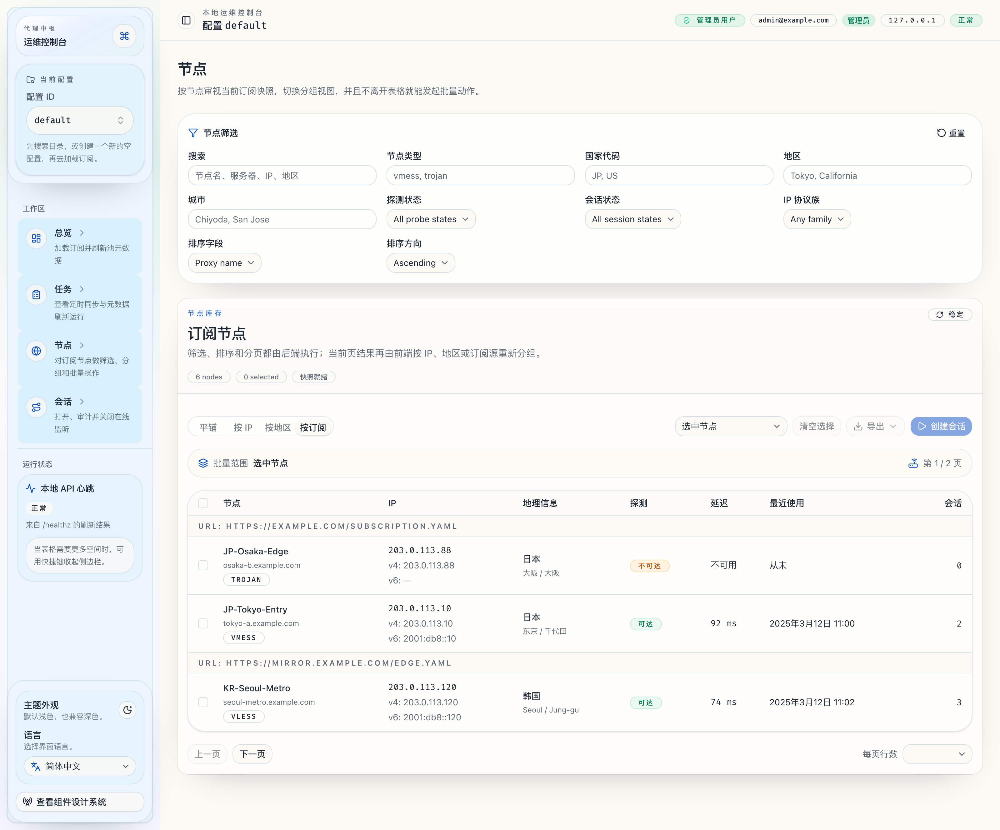

# 节点列表工作台替换 IP 提取页（#u4ymb）

## 状态

- Status: 已实现
- Created: 2026-03-29
- Last: 2026-03-29

## 背景 / 问题陈述

- 现有 `/ips` 工作台以“IP 提取”为中心，只适合临时筛选候选 IP，不适合长期管理订阅节点。
- 操作员缺少节点维度的筛选、排序、分页、分组、批量操作与导出能力。
- 当前 UI 无法直接看到节点关联的活跃会话数，也无法从节点清单直接批量创建会话。

## 目标 / 非目标

### Goals

- 用 `Nodes` 工作台替换现有 `IP Extract` 页面和侧栏入口。
- 节点行粒度固定为“订阅节点”，展示节点元数据、首选 IP、地区、探测状态、最近使用时间与关联会话数。
- 支持四种视图：一维列表、按 IP 分组、按地区分组、按订阅分组。
- 提供服务端筛选、排序、分页、导出与批量创建会话。
- 保留旧 `/ips` 路由作为到 `/nodes` 的兼容跳转。

### Non-goals

- 不扩展为“单 profile 多订阅源”模型。
- 不做跨 profile 的节点总览。
- 不删除现有 `POST /api/v1/profiles/{profile_id}/ips/extract` 后端接口。
- 不改变现有 `/sessions/open` 与 `/sessions/open-batch` 的既有语义。

## 功能与行为规格

### 节点聚合模型

- 每条节点记录以 `proxy_name` 为唯一 `node_id`。
- 每个节点最多展示一个 `ipv4` 和一个 `ipv6`；默认 `preferred_ip=ipv4 ?? ipv6 ?? first_resolved_ip`。
- 地区分组与地区筛选基于 `preferred_ip` 的地理元数据。
- 探测状态按节点聚合：
  - 任一 IP 探测成功则视为 `reachable`
  - 存在探测记录但无成功结果则视为 `unreachable`
  - 无探测记录则视为 `unprobed`
- `session_count` 通过当前 `sessions` 表中 `proxy_name` 相同的活跃会话数计算。
- 节点卡片展示的 `last_used_at` 取该节点所有关联 IP 的最近一次使用时间。

### 节点列表工作台

- 新主路由：`/nodes`
- 旧兼容路由：`/ips`，前端进入后立即跳转到 `/nodes`
- 页面首屏直接显示：
  - 视图模式切换
  - 节点筛选栏
  - 批量操作栏
  - 节点表格 / 分组表格
- 分页以“节点行”为单位，分组只对当前页结果做展示分段，不做分组桶级分页。

### 筛选、排序与分页

- 服务端筛选字段固定为：
  - `query`
  - `proxy_types[]`
  - `country_codes[]`
  - `regions[]`
  - `cities[]`
  - `probe_status`
  - `session_presence`
  - `ip_family`
- 服务端排序字段至少覆盖：
  - `proxy_name`
  - `proxy_type`
  - `preferred_ip`
  - `region`
  - `latency`
  - `last_used_at`
  - `session_count`
- 分页返回 `total / page / page_size`，默认页码从 `1` 开始。

### 批量操作

- 支持“显式选中节点”与“全部筛选结果”两种作用范围。
- 导出：
  - 支持 `CSV` 元数据导出
  - 支持纯文本节点链接导出（每行一个）
  - 导出按钮提供格式下拉选择
- 批量创建会话：
  - 按节点逐个尝试创建
  - 默认 `IPv4` 优先，无 `IPv4` 时回退 `IPv6`
  - 返回成功会话列表与节点级失败列表

## 接口与契约

- 新增 HTTP：
  - `POST /api/v1/profiles/{profile_id}/nodes/query`
  - `POST /api/v1/profiles/{profile_id}/nodes/export`
  - `POST /api/v1/profiles/{profile_id}/nodes/open-sessions`
- 更新共享契约文档：
  - `docs/contracts/http-apis.md`
  - `docs/contracts/rust-api.md`
  - `docs/specs/web-admin-ui.md`

## 验收标准

- 侧栏入口由 `IP Extract` 改为 `Nodes`，并进入 `/nodes`。
- `/ips` 仍可访问，但会跳转到 `/nodes`。
- 节点页支持四种视图切换，并对当前页结果进行对应分组展示。
- 节点表默认展示 `proxy_name / proxy_type / server / preferred_ip / ipv4 / ipv6 / geo / probe / latency / last_used_at / session_count`。
- 服务端完成筛选、排序与分页，前端只负责当前页分组与批量选择。
- 导出可生成 CSV 或纯文本节点链接文件；批量创建会话会返回成功与失败明细。
- Storybook 为 `Nodes` 页面和新增节点组件提供可复现状态覆盖。
- 视觉证据使用 Storybook 稳定截图并写回本 spec。

## 测试与质量门槛

- Rust:
  - 节点聚合、筛选、排序、分页、多格式导出、批量建会话
  - 新 API handler 与鉴权
- Frontend:
  - 视图切换、分组渲染、批量选择、批量 payload、空态/错态
- Storybook:
  - `NodesPage` default / loading / empty / grouped / batch-selected / error / zh-CN
- E2E:
  - 进入节点页、切换视图、筛选、分页、导出、批量创建会话

## 文档更新

- `docs/contracts/http-apis.md`
- `docs/contracts/rust-api.md`
- `docs/specs/web-admin-ui.md`
- `docs/specs/README.md`

## Visual Evidence

### 节点工作台主视图（`zh-CN`）

- source_type=storybook_canvas
- story_id_or_title=`Pages/NodesPage > Zh CN`
- state=`zh-CN localized default`
- evidence_note=验证新的 `/nodes` 主工作台已替换原 IP 提取入口，并展示筛选栏、视图切换、批量操作栏、节点表格、关联会话数与导出格式下拉菜单。

### 按订阅分组视图

- source_type=storybook_canvas
- story_id_or_title=`Pages/NodesPage > Grouped By Subscription`
- state=`group_by_subscription`
- evidence_note=验证节点列表支持按订阅分组展示，同时保留批量作用域、导出和创建会话入口。
