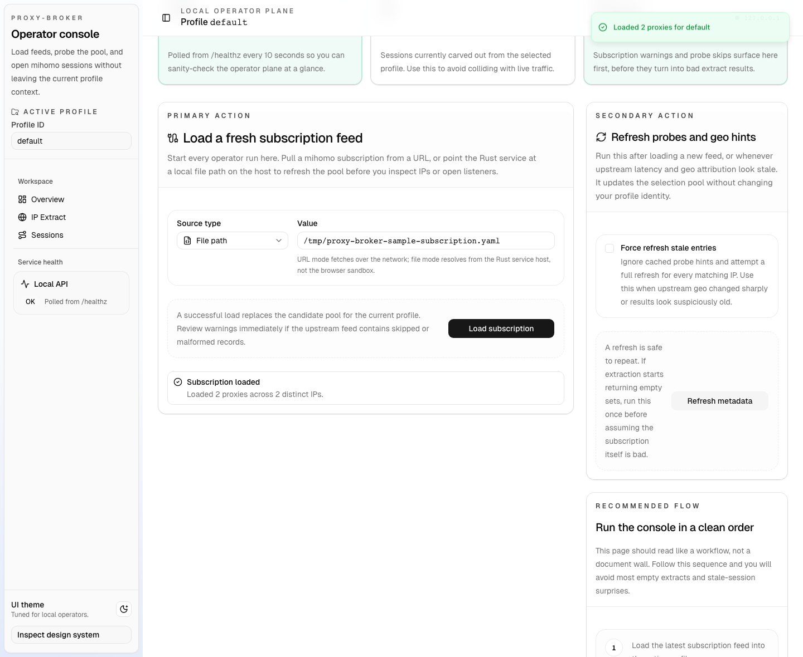
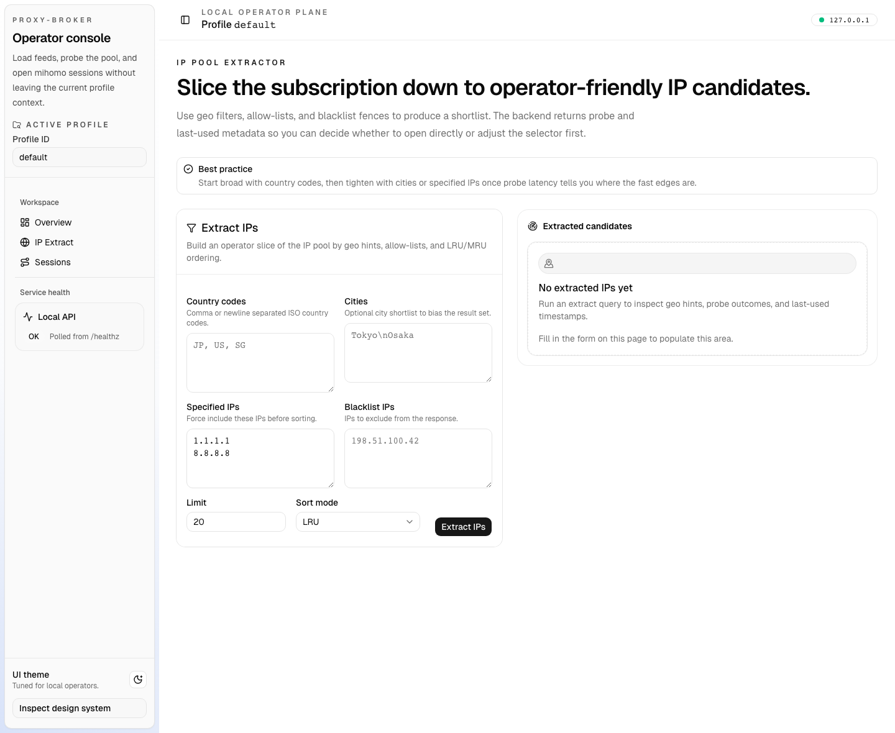
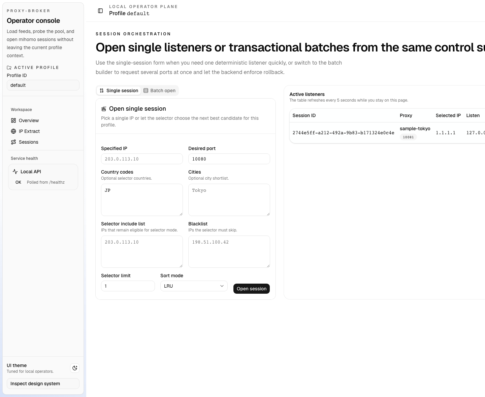

# Web Admin UI

## Goal

Add a Bun-driven operator web interface to `proxy-broker` without changing the
existing JSON API contracts. The first release must ship as a single Rust
binary that serves the built SPA on the same origin as the API, while keeping a
separate Vite and Storybook workflow for local development.

## Runtime Shape

- Backend remains the source of truth for subscription loading, refresh, IP
  extraction, and session lifecycle.
- Frontend lives in `web/` and is built with `Bun + Vite + React + TypeScript`.
- Production serving model:
  - `GET /` returns the SPA shell.
  - `GET /assets/*` serves bundled frontend assets.
  - Non-API frontend routes fall back to `index.html`.
  - `/api/v1/*` and `/healthz` keep their current behavior and priority.
- Storybook is development/documentation only and is not served by the
  production binary.

## Frontend Stack

- Package/runtime: Bun 1.x
- App framework: React 19 + React Router
- Styling: Tailwind CSS 4 + CSS variables
- Component system: shadcn/ui
- Data/query layer: TanStack Query
- Form/validation: React Hook Form + Zod
- Lint/format: Biome
- Unit/component tests: Vitest + Testing Library
- Component docs and interaction tests: Storybook 10 +
  `@storybook/test-runner`
- E2E smoke: Playwright

## Information Architecture

### Routes

- `/`
  - service health card
  - profile selector
  - subscription load form (`url` or server-side file path)
  - refresh card and latest refresh summary
- `/ips`
  - extract filter form
  - extracted IP table with geo/probe metadata
- `/sessions`
  - single open form
  - batch open form
  - active sessions table with close action

### Persistence

- The browser stores only UI-local preferences:
  - last used `profile_id`
  - last selected source type
  - last used extract presets if implemented as convenience state
- No client-side authoritative data cache beyond TanStack Query.

## Component Boundaries

- Route containers are thin:
  - wire queries and mutations
  - map API results into view props
  - own route-level loading and error surfaces
- Shared UI components are props-driven and Storybook-friendly:
  - metric cards
  - API state banners
  - filter chips / badges
  - tables
  - form sections and field groups
- shadcn primitives added to the repo are treated as first-class components and
  must be documented like custom components.

## Storybook Contract

- Story files are colocated with each component or page as `*.stories.tsx`.
- Every component or page under these paths must have a story file:
  - `web/src/components/ui/**`
  - `web/src/components/**`
  - `web/src/features/**/components/**`
  - `web/src/layouts/**`
  - `web/src/pages/**`
- Exclusions:
  - hooks
  - query helpers
  - fixtures
  - providers
  - type-only files
  - utility modules without UI
- Every story file must:
  - opt into autodocs with `tags: ["autodocs"]`
  - declare `title`
  - declare `component`
  - provide `parameters.docs.description.component`
- Minimum story coverage:
  - `Default` for every component/page
  - additional named stories for any supported public state such as `loading`,
    `empty`, `error`, `disabled`, `open`, or `populated`
- Storybook preview must inject:
  - app styles
  - router context
  - query client
  - toast/provider context
  - a stable theme shell
- A Bun verification script must fail CI when a covered component/page has no
  story or when a story file is missing autodocs metadata.

## Visual Direction

- Light-first admin console, tuned for dense operational work.
- Palette:
  - warm neutral background
  - slate text
  - teal/blue accents for primary actions and status highlights
- Typography:
  - expressive but readable headline font
  - monospace treatment for ports, IPs, IDs, and file paths
- Layout:
  - desktop-first split panels and data cards
  - mobile collapses into stacked sections with no hidden critical actions

## Interface Snapshots

### Overview Console

- Primary operator landing view with profile context, health summary, and the subscription load workflow.

### IP Extract Workspace

- Filter-driven extraction screen showing candidate IP rows with probe and location metadata.

### Sessions Workspace

- Session operations view with open controls and the live session table used for close actions.

## Build and Tooling

### Frontend Scripts

- `bun run dev` binds `127.0.0.1:38181`
- `bun run build` builds `web/dist`
- `bun run preview` previews the app locally
- `bun run check` runs Biome checks
- `bun run test` runs Vitest
- `bun run verify:stories` enforces story coverage and autodocs metadata
- `bun run storybook` binds `127.0.0.1:38182`
- `bun run build-storybook` outputs the static Storybook site
- `bun run test-storybook` runs Storybook interaction coverage
- `bun run test:e2e` runs the browser smoke flow

### Backend Build Rules

- `cargo build --release` must fail with a clear message if
  `web/dist/index.html` is missing.
- Runtime serving should prefer embedded assets for release builds.
- API handlers must remain unchanged except for router composition needed to
  mount static serving.

## Test Matrix

- Rust:
  - existing unit tests remain green
  - add route tests for `/`, `/assets/*`, SPA fallback, `/api/v1/*`,
    `/healthz`
- Frontend:
  - unit tests for helpers and small components
  - Storybook interaction tests for component behaviors
  - Playwright smoke for the end-to-end operator flow
- CI:
  - install frontend deps with Bun
  - run frontend checks/tests/docs gates before Rust checks
  - upload `storybook-static` as a PR artifact

## Acceptance Criteria

- A local operator can use the browser UI to:
  - load a subscription from URL or server-side file path
  - refresh profile metadata
  - extract IPs with the existing filters
  - open single or batch sessions
  - list and close sessions
- The built SPA is reachable from the Rust server root in production.
- Every committed UI component/page in scope has Storybook docs and stories.
- CI rejects missing stories or missing autodocs metadata.
- The repo remains Bun-first for frontend workflows and Cargo-first for backend
  workflows.
