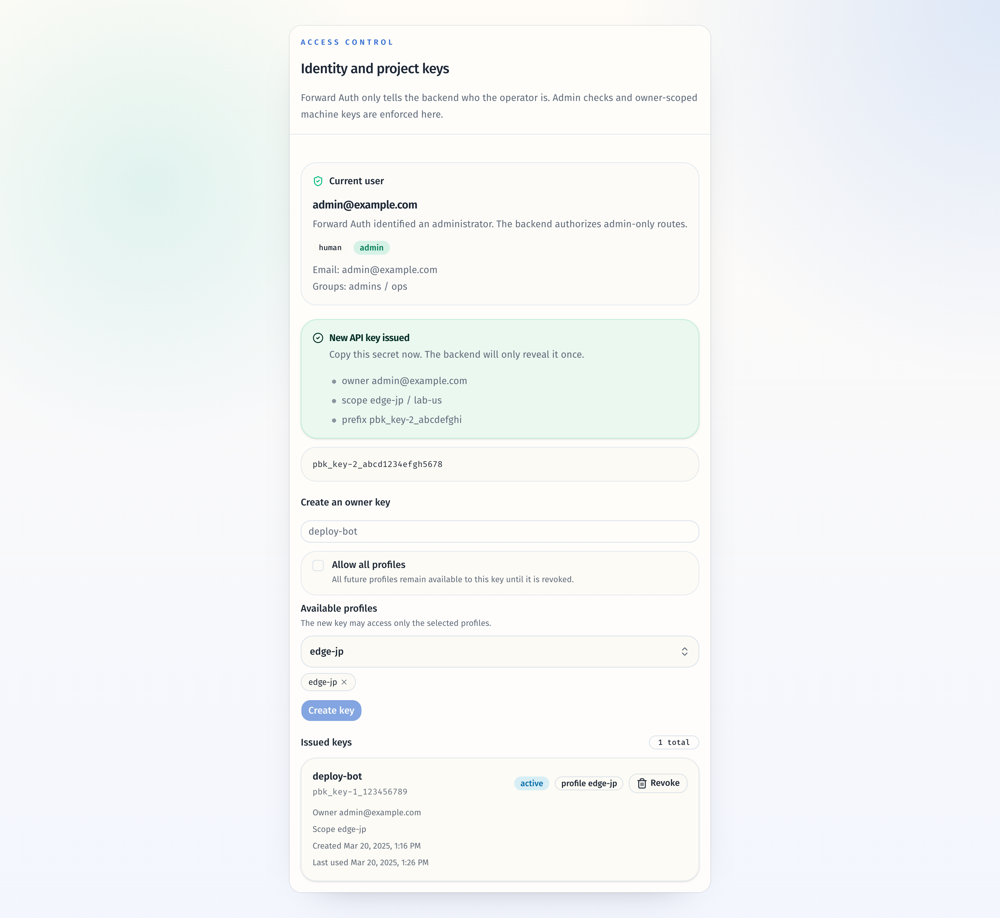
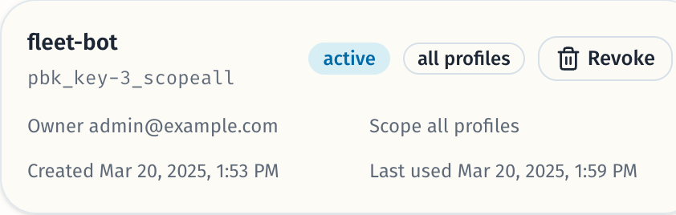
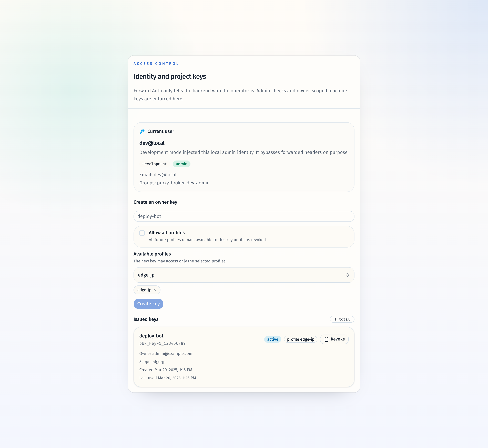
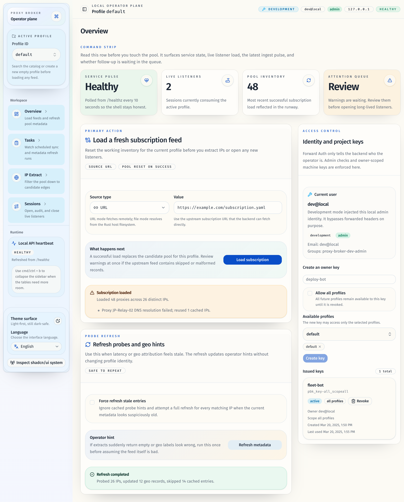

# 用户拥有的多 Project / All Projects API Key（#wfy5z）

## 状态

- Status: 已实现（本地已验证）
- Created: 2026-04-12
- Last: 2026-04-17

## Summary

- 将 API Key 从单 `project_id` 绑定模型升级为 `owner_subject + project_scope` 模型。
- 新增 `selected_projects` / `all_projects` 两种 scope；`all_projects` 为动态通配，未来新建 project 自动可用。
- 新增全局 key-management API：`GET /api/v1/api-keys`、`POST /api/v1/api-keys`、`DELETE /api/v1/api-keys/{key_id}`，管理范围限定为当前 owner 自己的 keys。
- Web 管理台复用现有 `SearchableMultiSelect`，允许管理员为新 key 选择多个 projects 或 `all projects`，并稳定展示 owner / scope。

## Scope

- Rust models / auth / store / service / HTTP router / tests。
- SQLite + Memory store 的 API Key 持久化与历史单 project 数据兼容迁移。
- Web Overview 的 Access Control 卡片、Current User 展示、API client/types、Storybook stories/docs/play。
- README、部署说明、HTTP/DB contracts、forward-auth smoke。

## Acceptance Criteria

- 新创建的 API Key owner 始终等于签发时的 `principal.subject`，不再由单个 `project_id` 代表所有权。
- `selected_projects` key 仅允许访问命中的 projects；未命中返回 `403 project_access_denied`。
- `all_projects` key 可以访问创建后新增的 projects。
- `GET /api/v1/api-keys` 仅返回当前 owner 自己的 keys；`DELETE /api/v1/api-keys/{key_id}` 也仅能撤销当前 owner 的 key。
- `AuthMeResponse` 在 `principal_type=api_key` 时暴露 owner + scope；旧 `project_id` 只在单 project 兼容路径下出现。
- Overview 管理台可创建 `selected_projects` 与 `all_projects` keys，并稳定展示 owner / scope 信息。

## Interfaces

- `CreateApiKeyRequest`
  - `name: string`
  - `project_scope.kind: selected_projects | all_projects`
  - `project_scope.project_ids[]`：仅 `selected_projects` 需要，必须非空、去重、且全部存在于 project catalog
- `ApiKeySummary`
  - 新增 `owner_subject`
  - 新增 `project_scope`
  - 兼容字段 `project_id?` 仅在 scope 为单元素 `selected_projects` 时返回
- `AuthMeResponse`
  - 新增 `api_key_owner_subject?`
  - 新增 `api_key_project_scope?`

## Outcome

- 后端 API Key 认证与授权已切换到 owner-scoped 模型：`created_by_subject` 作为 canonical owner，`scope_kind + api_key_projects` 表示授权范围。
- 旧 SQLite `api_keys.project_id` 数据会在迁移时自动回填成 `selected_projects=[legacy project_id]`，并已补齐迁移测试。
- 现有 `/api/v1/projects/{project_id}/...` 业务路由继续保持不变，但 API Key 判权已改为 scope 命中判断。
- 管理台的 Access Control 卡片已切到全局 `/api/v1/api-keys*` 契约，补齐了默认当前 project、multi-selected、all projects、anonymous / development 等 Storybook 覆盖。
- README、部署说明、HTTP/DB contracts 与 forward-auth smoke 已同步到 owner-scoped / selected-or-all 语义。

## Verification

- `cargo fmt --all`
- `cargo test --all-features`
- `cargo clippy --all-targets --all-features -- -D warnings`
- `cd web && bun run format`
- `cd web && bun run check`
- `cd web && bun run test`
- `cd web && bun run typecheck`
- `cd web && bun run build`
- `cd web && bun run verify:stories`
- `bash -n scripts/forward-auth/smoke.sh`

## Visual Evidence

- `证据绑定sha=6304e36ca1889034280f62ffaf4ee707745df5fb`
- `source_type=storybook_canvas`
- `target_program=mock-only`
- `capture_scope=browser-viewport`
- `sensitive_exclusion=N/A`
- `submission_gate=owner-approved`
- `story_id_or_title=Features/Overview/AccessControlCard/WithFreshSecret`
- `state=fresh secret + multi-project scope`
- `evidence_note=展示 owner-scoped key 的一次性 secret 面板，并明确显示归属者与多 project scope。`

- `source_type=storybook_canvas`
- `target_program=mock-only`
- `capture_scope=browser-viewport`
- `sensitive_exclusion=N/A`
- `submission_gate=owner-approved`
- `story_id_or_title=Features/Overview/AccessControlCard/AllProjects`
- `state=existing all-projects key`
- `evidence_note=展示这次布局修复后的 issued key 卡片：owner/scope 与 created/last used 已并排铺开，直接证明右侧留白被收紧。`

- `source_type=storybook_canvas`
- `target_program=mock-only`
- `capture_scope=browser-viewport`
- `sensitive_exclusion=N/A`
- `submission_gate=owner-approved`
- `story_id_or_title=Features/Overview/AccessControlCard/DevelopmentOperator`
- `state=development principal + key management`
- `evidence_note=展示 development 身份下的当前用户摘要与 owner-scoped key 管理入口，证明管理台在开发模式下仍保留一致的 owner / scope 语义。`

- `source_type=storybook_canvas`
- `target_program=mock-only`
- `capture_scope=browser-viewport`
- `sensitive_exclusion=N/A`
- `submission_gate=owner-approved`
- `story_id_or_title=Pages/OverviewPage/AllProjectsKeyState`
- `state=overview integration`
- `evidence_note=展示 Overview 路由整页已接入全局 API key 管理契约，右侧 Access Control 卡片与当前用户摘要保持一致。`

## Change log

- 2026-04-12：创建 follow-up spec，冻结 owner-scoped API key 的范围、契约与验证口径。
- 2026-04-12：完成 owner-scoped / selected-or-all API key 实现、持久化迁移、Web 管理台改造、文档同步与 Storybook 视觉证据。
- 2026-04-17：收敛 rebase 后的布局回归，压缩 Issued keys 元数据区的横向留白，并刷新 all projects 视觉证据。
