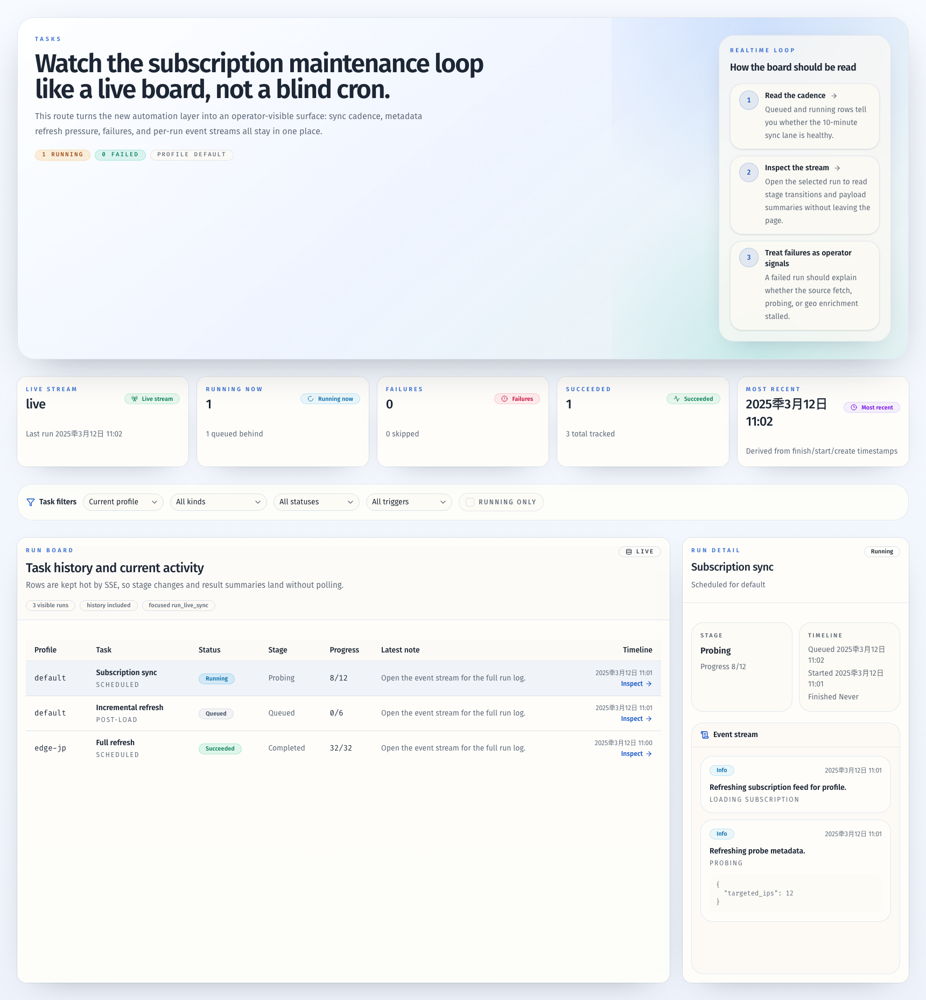

# Task Module And Auto Subscription Maintenance（#y5yx8）

## 状态

- Status: 已完成
- Created: 2026-03-22
- Last: 2026-03-28

## 背景 / 问题陈述

- 当前 `load subscription` 只会导入节点与 IP 池，初次导入后的 `probe` / `geo` 元数据仍为空，操作员必须手动再做一次 `refresh`。
- 线上控制台没有任务中心，自动任务不存在，任务运行进度、失败原因与最近一次更新时间都不可见。
- 现有前端对实时状态的处理以轮询为主，没有面向任务监控的 `SSE` 实时流。

## 目标 / 非目标

### Goals

- 为 profile 引入可持久化的自动订阅维护配置。
- 在服务启动后自动执行：
  - 每 10 分钟订阅同步，并仅对新增 IP 做元数据刷新。
  - 每 24 小时对全部 IP 强制刷新 probe 与 geo。
- 新增一个 `Tasks` 顶层 workspace，提供实时任务监控、筛选与运行详情。
- 用 `SSE` 把任务 summary、列表行与事件流实时推送到前端。

### Non-goals

- 不把现有手动 `refresh` / `extract` / `session open` 改造成异步任务 API。
- 不做任务暂停、恢复、取消或手动重跑。
- 不为 profile API key 提供任务中心或任务 SSE 消费。

## 范围（Scope）

### In scope

- 新增 `profile_sync_configs`、`task_runs`、`task_run_events` 持久化模型。
- 成功 `load subscription` 后，持久化当前 source 配置，并自动排入一条 `post_load` 的增量元数据任务。
- 引入后台 supervisor / scheduler，在服务启动时扫描已启用 profile 并自动调度。
- 新增任务查询、详情、SSE 流接口。
- 新增 `/tasks` 页面、侧栏入口、任务筛选条、摘要卡、任务表与事件详情抽屉。

### Out of scope

- 任务 retention 配置页面。
- 自定义 cron / 任意调度周期。
- 面向非管理员的任务 API 权限模型扩展。

## 需求（Requirements）

### MUST

- `load subscription` 成功后必须记录 profile 的订阅源，并自动触发首轮新增 IP 元数据刷新。
- 自动同步不得清空现有可用订阅快照；失败时只记录任务失败。
- 同一 profile 同时最多运行一个自动任务；重叠到期信号必须折叠，不得并发执行。
- `Tasks` 页面默认聚焦当前 profile，管理员可切换为 `all profiles` 汇总。
- 任务页面数据必须通过 `SSE` 实时推送更新，而不是退回轮询。

### SHOULD

- 任务详情应展示阶段、进度、结果摘要与事件时间线。
- SSE 首包提供完整 snapshot，后续只推增量更新。
- 页面断线时要显示 `reconnecting` / `degraded` 状态，而不是静默失联。

### COULD

- 对运行中任务提供轻量 pulse 动效与阶段切换动画，但必须尊重 `prefers-reduced-motion`。

## 功能与行为规格（Functional/Behavior Spec）

### 自动调度

- 成功 `load subscription` 后：
  - 更新该 profile 的 `profile_sync_configs`。
  - 立即创建 `metadata_refresh_incremental` 任务，`trigger=post_load`。
- 自动调度器每 30 秒扫描一次已启用 profile：
  - 若 `sync_every_sec=600` 到期，执行 `subscription_sync`。
  - 若 `full_refresh_every_sec=86400` 到期，执行 `metadata_refresh_full`。
  - 若二者同时到期，先同步订阅，再直接执行全量强刷，不额外排一次 incremental refresh。

### 任务运行

- `subscription_sync`
  - 读取已持久化 source。
  - 拉取上游订阅，完成 diff。
  - 持久化新的节点/IP 快照。
  - 若存在新增 IP，继续触发同一轮后续增量元数据刷新。
- `metadata_refresh_incremental`
  - 只针对“新引入的 IP 记录”做 probe 与 geo 更新。
- `metadata_refresh_full`
  - 对当前 profile 全量 IP 强制刷新 probe 与 geo，忽略缓存 TTL。

### 前端任务中心

- 顶层导航新增 `Tasks`。
- 页面结构：
  - 首屏直接进入实时摘要卡与任务筛选条。
  - 筛选条：`profile`、`kind`、`status`、`trigger`、`running_only`。
  - 左侧高密度任务表。
  - 右侧运行详情抽屉/事件流。
- 默认表格展示最近 7 天任务；详情打开单条 run 时显示完整事件日志。
- 管理员在 `all profiles` 模式下可看到跨 profile 汇总与混合列表。

## 接口契约（Interfaces & Contracts）

### 接口清单（Inventory）

| 接口（Name） | 类型（Kind） | 范围（Scope） | 变更（Change） | 契约文档（Contract Doc） | 负责人（Owner） | 使用方（Consumers） | 备注（Notes） |
| --- | --- | --- | --- | --- | --- | --- | --- |
| Task query APIs | HTTP | external | New | ./contracts/http-apis.md | proxy-broker | web admin UI | 列表与详情 |
| Task event stream | SSE | external | New | ./contracts/http-apis.md | proxy-broker | web admin UI | `text/event-stream` |
| Task persistence | DB | internal | New | ./contracts/db.md | proxy-broker | Rust store/service | SQLite + memory store |

### 契约文档（按 Kind 拆分）

- [contracts/README.md](./contracts/README.md)
- [contracts/http-apis.md](./contracts/http-apis.md)
- [contracts/db.md](./contracts/db.md)

## 验收标准（Acceptance Criteria）

- Given 任意 profile 成功完成 `load subscription`
  When 请求返回 200
  Then 服务端会持久化 source 配置，并立刻生成一条 `post_load` 的增量元数据任务。
- Given 服务已启动且 profile 启用了自动同步
  When 到达 10 分钟周期
  Then 会自动生成并执行 `subscription_sync`，无需人工打开页面。
- Given 服务已启动且 profile 到达 24 小时全量刷新周期
  When 调度器扫描到期
  Then 会自动生成 `metadata_refresh_full` 并对所有 IP 强制刷新元数据。
- Given 管理员打开 `/tasks`
  When SSE 连接建立
  Then 页面先收到完整 snapshot，后续随着任务状态变化实时更新摘要、列表行与事件时间线。
- Given 某次自动同步失败
  When 任务结束
  Then 既有订阅快照仍保留，任务记录带 `failed` 状态与错误摘要。

## 实现前置条件（Definition of Ready / Preconditions）

- `Tasks` 作为新的顶层 workspace 路由已确认。
- 首版任务中心只读，不提供手动控制动作。
- `SSE` 仅对管理员 / development principal 开放已确认。

## 非功能性验收 / 质量门槛（Quality Gates）

### Testing

- Rust unit/integration tests:
  - store schema 与查询
  - scheduler 到期逻辑
  - 单 profile 非并发保证
  - task query / detail / SSE API
- Frontend tests:
  - tasks 页面筛选与空态/错误态
  - SSE 增量更新与断线提示
- E2E:
  - `/tasks` 导航、筛选、详情查看与实时更新 smoke

### UI / Storybook

- Stories to add/update:
  - `TasksPage` default / running / filtered / error / disconnected
  - `TaskSummaryCards`
  - `TaskFiltersBar`
  - `TasksTable`
  - `TaskRunDetailPanel`

### Quality checks

- `cargo test`
- `bun run check`
- `bun run typecheck`
- `bun run test`
- `bun run verify:stories`
- `bun run build`
- `bun run test:e2e`

## 文档更新（Docs to Update）

- `docs/contracts/http-apis.md`
- `docs/contracts/rust-api.md`
- `docs/contracts/db.md`
- `docs/specs/README.md`

## 计划资产（Plan assets）

- Directory: `docs/specs/y5yx8-task-module-and-auto-subscription-maintenance/assets/`
- In-plan references: ``
- PR visual evidence source: maintain `## Visual Evidence (PR)` when PR screenshots are needed.

## Visual Evidence

- source_type: storybook_canvas
  target_program: mock-only
  capture_scope: browser-viewport
  sensitive_exclusion: N/A
  submission_gate: pending-owner-approval
  story_id_or_title: Pages/TasksPage/ZhCN
  state: live content-first layout
  evidence_note: 验证任务中心已取消顶部 RouteHero，页面首屏直接呈现摘要卡、筛选条、运行表和右侧事件详情流。
  image:
  

## 实现里程碑（Milestones / Delivery checklist）

- [x] M1: 新 spec、contracts 与全局文档索引完成更新。
- [x] M2: Rust models/store/service/scheduler 完成任务持久化与自动调度。
- [x] M3: HTTP + SSE 任务接口完成。
- [x] M4: Web `/tasks` 监控页面与实时集成完成。
- [x] M5: Stories、测试与验证全部通过。

## 方案概述（Approach, high-level）

- 在 `BrokerService` 里新增任务 supervisor 与广播事件总线，服务启动后自动拉起。
- 让 `load subscription` 保持同步 contract 不变，但在成功路径上额外登记自动维护配置，并排入增量刷新任务。
- 任务监控页使用 light-first 控制台样式，但强化实时状态层级、筛选条与详情流。

## 风险 / 开放问题 / 假设（Risks, Open Questions, Assumptions）

- 风险：后台调度与手动 `load/refresh` 会共享 profile lock，若任务阶段过粗，可能放大单 profile 等待时间。
- 风险：`SSE` 需要处理 snapshot + delta 一致性，前后端 contract 必须稳定。
- 假设：自动增量元数据刷新的判定单位按“新增 IP”落地，而不是“新增 proxy name”。

## 变更记录（Change log）

- 2026-03-22: 初始规格，冻结任务模块、自动订阅维护与 SSE 方案。
- 2026-03-22: 实现完成，补齐任务中心视觉证据并将规格状态同步为已完成。

## 参考（References）

- `docs/specs/web-admin-ui.md`
- `docs/specs/s3zu5-admin-ui-refresh/SPEC.md`
- `docs/contracts/http-apis.md`
